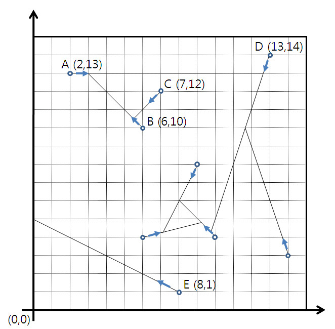

## 문제

정사각형 형태의 울타리 내부에 N마리의 달팽이가 있다. 모든 달팽이는 시작 위치에서 동시에 움직이기 시작하여 다음의 규칙에 따라 이동한다.

1. 모든 달팽이의 시작 위치는 모두 다르다.
2. 모든 달팽이는 각자 움직이는 방향이 주어지고, 주어진 방향을 따라 직선으로만 움직인다.
3. 모든 달팽이의 움직이는 속력은 1초당 1cm로 동일하다.
4. 달팽이는 울타리에 도달하면 멈춘다.
5. 달팽이는 다른 달팽이가 이미 지나간 지점에 도달하면 멈춘다.
6. 둘 이상의 달팽이가 한 곳에서 동시에 만나면 모두 멈춘다.

다음의 그림은 9마리 달팽이의 움직임을 나타낸 것이다. 이 그림에서 한 칸의 길이는 1cm이다.

위의 그림에서 달팽이 C는 달팽이 B가 지나간 지점을 만날 때 멈추고, B는 A가 지나간 지점을 만날 때 멈춘다. 달팽이 E는 울타리에 도달할 때 멈춘다.

N마리 달팽이의 시작 위치와 움직이는 방향이 주어질 때, 달팽이가 시작 위치에서 동시에 움직이기 시작하여 모든 달팽이가 멈추기까지 걸린 시간을 구하는 프로그램을 작성하시오. 단, 소수점이하 셋째 자리에서 반올림하여 출력하시오. 왼쪽 그림의 예에서, 마지막에 멈춘 달팽이는 A이고, 이때까지 걸린 시간은 10.67초이다.

## 입력

첫째 줄에는 달팽이의 수 N(1 ≤ N ≤ 1,000)과 울타리 한 변의 길이(cm)를 나타내는 자연수 L(10 ≤ L ≤ 10,000)이 빈칸을 사이에 두고 주어진다. 울타리의 왼쪽 아래 좌표는 (0, 0)이고 오른쪽 위의 좌표는 (L, L)이다. 다음 N개의 줄에는 각 달팽이의 시작 위치와 방향에 대한 정보를 나타내는 4개의 정수 x, y, p, q(0 < x, y, p, q < L)가 빈칸을 사이에 두고 차례로 주어진다. 이는 달팽이가 시작 위치를 나타내는 점 (x, y)로부터 점 (p, q)를 향한 방향으로 움직이는 것을 의미한다. 점 (x, y)와 점 (p, q)는 서로 다르다.

## 출력

첫째 줄에 모든 달팽이가 멈추기까지 걸린 시간을 소수점이하 셋째 자리에서 반올림하여 출력하시오. 시간의 출력은 반드시 소수점이하 두 자리까지 나타내도록 하시오. 예를 들어 시간이 10.667인 경우 10.67로, 시간이 5인 경우 5.00으로, 시간이 5.5인 경우에는 5.50으로 출력한다.
