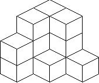
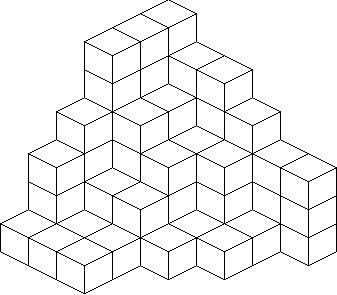

## 문제

Consider the following pattern of positive integers:

```

3 3 1 
3 1 
2
```

Note that each row is left-justified and no longer than its preceding row. Also, the entries in each row,when read left to right, are non-increasing and the entries in each column, when read top to bottom are non-increasing. We will call such a pattern a stacking pattern (SP) because such a pattern can represent a way of stacking cubes in a corner in the following way: if you consider placing the topmost row and leftmost column against walls, then the SP gives a bird's-eye view of how many cubes are stacked vertically. The SP above represents the following corner stacking:



We will call the wall against the topmost row the right wall , and the wall against the leftmost column the left wall. Here is another SP and the corner stacking it represents:

```

6 5 5 4 3 3 
6 4 3 3 1 
6 4 3 1 1 
4 2 2 1
3 1 1 
1 1 1
```



Note that if you rotate a corner stacking so the left wall becomes the floor and the floor becomes the right wall, you still have a corner stacking. (We will call this a left rotation.) Likewise, you would still have a corner stacking if you rotate so the right wall becomes the floor and the floor becomes the left wall. (We will call this a right rotation.) So the SP of the left and right rotations of the first SP given above are

```

3 2 1        3 3 2
2 1 1        2 1 1
2 1          1
```

You should check that both the left and right rotations of the second example SP are identical to the original SP.

## 입력

This problem will consist of multiple problem instances. Each problem instance will consist of a positive integer n <= 11 indicating the number of rows in the SP that follows. (n = 0 indicates the end of input.)The rows of the SP will follow, one per line with entries separated by single spaces, delimited by a trailing 0. (The trailing 0 is, of course, not part of the input data proper and you may assume that each row given has at least one cube.) Each entry in the pattern proper will be a positive integer less than or equal to 20 and there will be no more than 20 entries in any row.

## 출력

For each input SP you should produce two stacking patterns corresponding to the left rotation and the right rotation (in that order). Rows of the SP should be left-justified with entries separated by a single space. One blank line should separate the left and right rotations of the given SP and two blank lines should separate output for different problem instances.
