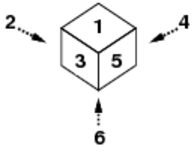
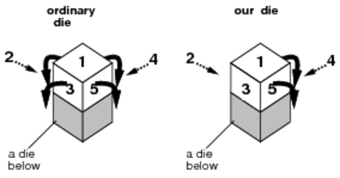
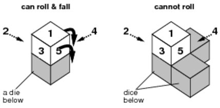
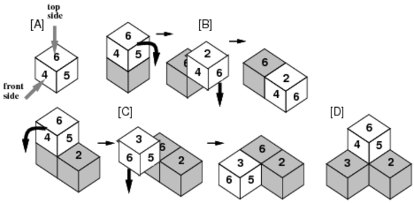
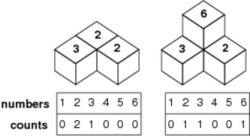

## 문제

Professor Random, known for his research on randomized algorithms, is now conducting an experiment on biased dice. His experiment consists of dropping a number of dice onto a plane, one after another from a fixed position above the plane. The dice fall onto the plane or dice already there, without rotating, and may roll and fall according to their property. Then he observes and records the status of the stack formed on the plane, specifically, how many times each number appears on the faces visible from above. All the dice have the same size and their face numbering is identical, which we show in Figure C-1.



Figure C-1: Numbering of a die

The dice have very special properties, as in the following.

(1) Ordinary dice can roll in four directions, but the dice used in this experiment never roll in the directions of faces 1, 2 and 3; they can only roll in the directions of faces 4, 5 and 6. In the situation shown in Figure C-2, our die can only roll to one of two directions.



Figure C-2: An ordinary die and a biased die

(2) The die can only roll when it will fall down after rolling, as shown in Figure C-3. When multiple possibilities exist, the die rolls towards the face with the largest number among those directions it can roll to.



Figure C-3: A die can roll only when it can fall

(3) When a die rolls, it rolls exactly 90 degrees, and then falls straight down until its bottom face touches another die or the plane, as in the case [B] or [C] of Figure C-4.

(4) After rolling and falling, the die repeatedly does so according to the rules (1) to (3) above.



Figure C-4: Example stacking of biased dice

For example, when we drop four dice all in the same orientation, 6 at the top and 4 at the front, then a stack will be formed as shown in Figure C-4.



Figure C-5: Example records

After forming the stack, we count the numbers of faces with 1 through 6 visible from above and record them. For example, in the left case of Figure C-5, the record will be "0 2 1 0 0 0", and in the right case, "0 1 1 0 0 1".

## 입력

The input consists of several datasets each in the following format.

```

n 
t1  f1
t2  f2
... 
tn  fn
```

Here, n (1 ≤ n ≤ 100) is an integer and is the number of the dice to be dropped. ti and fi (1 ≤ ti, fi ≤ 6) are two integers separated by a space and represent the numbers on the top and the front faces of the i-th die, when it is released, respectively.

The end of the input is indicated by a line containing a single zero.

## 출력

For each dataset, output six integers separated by a space. The integers represent the numbers of faces with 1 through 6 correspondingly, visible from above. There may not be any other characters in the output.
