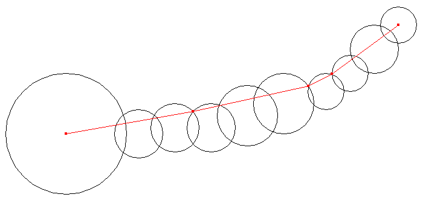
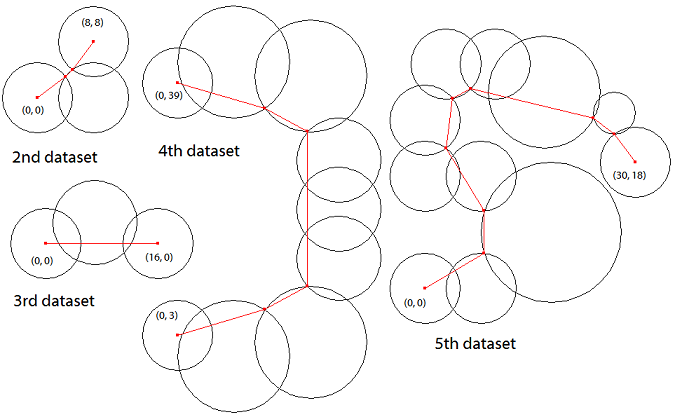

## 문제

There is a chain consisting of multiple circles on a plane. The first (last) circle of the chain only intersects with the next (previous) circle, and each intermediate circle intersects only with the two neighboring circles.

Your task is to find the shortest path that satisfies the following conditions.

* The path connects the centers of the first circle and the last circle.
* The path is confined in the chain, that is, all the points on the path are located within or on at least one of the circles.

Figure E-1 shows an example of such a chain and the corresponding shortest path.



Figure E-1: An example chain and the corresponding shortest path

## 입력

The input consists of multiple datasets. Each dataset represents the shape of a chain in the following format.

```

n
x1 y1 r1
x2 y2 r2
...
xn yn rn
```

The first line of a dataset contains an integer n (3 ≤ n ≤ 100) representing the number of the circles. Each of the following n lines contains three integers separated by a single space. (xi, yi) and ri represent the center position and the radius of the i-th circle Ci. You can assume that 0 ≤ xi ≤ 1000, 0 ≤ yi ≤ 1000, and 1 ≤ ri ≤ 25.

You can assume that Ci and Ci+1 (1 ≤ i ≤ n−1) intersect at two separate points. When j ≥ i+2, Ci and Cj are apart and either of them does not contain the other. In addition, you can assume that any circle does not contain the center of any other circle.

The end of the input is indicated by a line containing a zero.

Figure E-1 corresponds to the first dataset of Sample Input below. Figure E-2 shows the shortest paths for the subsequent datasets of Sample Input.



Figure E-2: Example chains and the corresponding shortest paths

## 출력

For each dataset, output a single line containing the length of the shortest chain-confined path between the centers of the first circle and the last circle. The value should not have an error greater than 0.001. No extra characters should appear in the output.
