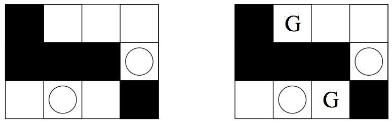

## 문제

Once upon a time, there was a kingdom. It had everything a kingdom needs, namely a king and his castle. The ground-plan of the castle was a rectangle that was divided into M × N unit squares. Some of the squares are walls, some of them are free. We will call each of the free squares a room. The king of our kingdom was extremely paranoid, so one day he decided to make hidden pits (with alligators at the bottom) in some of the rooms.

But this was still not enough. One week later, he decided to place as many guards as possible inside his castle. However, this won’t be so simple. The guards are trained so that immediately after they see someone, they shoot at him. And so the king has to place the guards carefully, because if two guards would see each other, they would shoot at themselves! Also evidently the king can’t place a guard into a room with a pit.

Two guards in a room see each other, so each room may contain at most one guard. Two guards in different rooms see each other if and only if the squares corresponding to their rooms are in the same row or in the same column of the plan of the castle and there is no wall between them. (The guard can see only in four directions, much like a rook in chess.)

Your task is to find out, how many guards can the king place inside his castle (according to the rules above) and to find one possible assignment of that many guards into the rooms.

## 입력

The first line of the input file contains two numbers M, N (1 ≤ M, N ≤ 200) – the dimensions of the ground-plan of the castle. The i-th of the following M lines contains N numbers ai,1, . . . , ai,N, separated by single spaces, where:

* ai,j = 0 means that the square [i, j] is free (a room without a pit)
* ai,j = 1 means that the square [i, j] contains a pit
* ai,j = 2 means that the square [i, j] is a wall

Note that the first coordinate of a square is the row and the second one is the column.

## 출력

The first line of the output file should contain the maximum number K of guards the king may place inside his castle. The following K lines should contain one possible assignment of K guards into the free rooms of the castle so that no two guards would see each other.

More precisely, the i-th of these lines should contain two integers ri, ci separated by a single space – the coordinates of the room where i-th guard will be placed (ri is the row and ci is the column).

## 힌트

Castle from the example input and one possible correct output.
