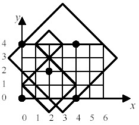

## 문제

Consider a planer grid of M rows and N columns. This grid has exactly MN intersections, each of which is denoted by a pair of coordinates (i, j) where i = 0, 1, ..., N-1 and j = 0, 1, ..., M-1.

Suppose K <= MN points are now placed on K distinct grid intersections.

Consider a diamond shaped area D(i, j, r) such that the centre of the area is at intersection (i, j) and the shape itself is a square of diagonal length 2r, rotated 45 degree clockwise, where i = 0, 1, ..., N-1, j = 0, 1, ..., M-1, and r, the radius of the diamond shape, is any integer greater than 0.

Manoranjan is interested in finding the minimum radius, Rmin(Pmin), of such a diamond shape that would guarantee of covering at least Pmin points no matter at which grid intersection the centre of the shape resides, where Pmin = 1, 2, ..., K. Let Pmax(Pmin) be the maximum number of points that can be covered by a diamond shape of radius Rmin(Pmin). Consider the example in the figure below. Five points at intersections (0,0), (4,0), (2,2), (0,4), and (4,4) are placed on a planer grid of 5 rows and 7 columns. The diamond shape D(2,4,1) covers none of the points, D(2,1,2) covers one point, and D(3,3,4) covers four points.

## 입력

The number of rows, M, and columns, N, of the grid are given in line 1. K number of points are then given in the next one or more lines, where K ≤ MN. You may assume that 1 ≤ M ≤ 100 and 1 ≤ N ≤ 100. A pair of integers, representing x- and y-coordinates of the point respectively, denotes each point.

All the values given in any of the input lines are separated from each other by one or more white spaces including tabs.

## 출력

Any given point outside the grid is discarded as "invalid" entries, e.g., the last point given in the sample input is discarded. For each possible Pmin value, corresponding Rmin(Pmin) and Pmax(Pmin) values are written in a separate line as per the format shown in the sample output. However, a line of output should only be generated if a diamond shape of radius Rmin(Pmin) guarantees to cover exactly Pmin points. In the sample output, no line is generated for Pmin = 2 as Rmin(2) = Rmin(3) = 6.

All values are written right aligned to their column headings.
