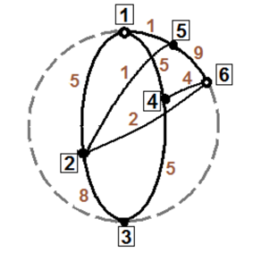

## 문제

An extreme solar eruption has heated the Earth, causing a monstrous cataclysm. Tectonic plates are floating freely along the Earth’s mantle; earthquakes with unseen magnitudes are causing metropolises to collapse to the ground; mountains are inundated by gigantic tsunamis; countries are turning to oceans of lava and volcanic dust.

It’s 21 December 2012 and your only chance to save yourself and your family from the apocalypse is to reach the government ships in the Himalayas – the modern arks that will save mankind. You have an airplane that flies with constant speed and a map with all standing airports. Unfortunately, not all pairs of airports are connected – enormous clouds of volcanic dust are blocking some of the routes, while other airports are too far away from each other. Furthermore, not all airports have fuel available – some of them have nothing left but the naked roads – and there you can’t refuel the aircraft. And since all means of navigation are destroyed, the only possible path between two airports is the shortest one. And on top of all, due to atmospheric instability and dramatic changes of air density, the fuel efficiency of the engines varies between flights. Thus the fuel consumption is also different. The good new is that you know between which airports it is possible to fly and the amount of fuel it would cost, and also where you can refuel. All you have to do is find a way to get from your airport to the airport in the Himalayas as fast as possible. Write a program that computes the minimum amount of time required to achieve that task, given the coordinates of each airport and whether it has fuel, the fuel tank capacity of the airplane, the speed of the airplane, which pairs of airports are connected by a potential flight and how much fuel does each flight require.

## 입력

The first line of the standard input consists of four integers: N, M, V and C – the number of airports, the number of pairs of connected airports, the constant speed of the aircraft and the fuel tank capacity, respectively. The next N lines give information about airports. Airports are represented by points in 3-dimensional space and all of them lie on the surface of the Earth whose center is at the origin - (0,0,0). The i-th of these lines consists of three real numbers and a Boolean: Xi, Yi, Zi and Ri – the coordinates of the i-th airport and whether you can refuel in it (Ri = 1 means you can, Ri = 0 means you can’t). The next M lines give information about potential flights. Each pair of connected airports is unordered, i.e. a flight from A to B has the same properties as a flight from B to A. The k-th of these lines consists of three integers: Ak, Bk and Fk, denoting a potential flight from airport Ak to airport Bk (consequently from Bk to Ak as well) that requires an amount of fuel equal to Fk (in either direction). The last line consists of integers S and T – the first and the last airport in your route.

## 출력

The only line of the standard output must be one real number representing the minimum time required to get from airport S to airport T. An answer is considered correct if it differs from the author’s by no more than 10-4. If a route cannot be found and you are doomed, just print 0 (zero on one line).

## 힌트

Earth’s radius is 5. The airplane’s speed is 2.5 and the fuel tank capacity is 9. We want to get from 1 to 3. In the picture, potential flights are represented by black arcs, airport numbers are inside the squares and fuel consumption is noted beside the corresponding arcs. Points where we can refuel have a white dot in the middle. Obviously, we can’t simply use the direct routes 1-2-3 and 1-4-3: their fuel consumption is 13 and 10, respectively, which is more than the tank capacity. In fact, all routes use up an amount of fuel more than 9 so our only chance is to refuel in airport 6. There are three possible routes to it: 1-2-6, 1-4-6 and 1-5-2-6. The first two are obviously the shorter ones (flights 1-2, 5-2, 2-6, 1-4 and 4-6 require an equal amount of time). After we fill up the tank in 6, if we go to 2 we still won’t be able to continue to 3 – we’ll be short fuel with one unit. The only route is through 4 and although we’ll have no fuel when we reach 3, we will be saved. To sum up, the optimal routes are 1-2-6-4-3 and 1-4-6-4-3. They are both represented by four 90-degree arcs, which makes their total length equal to Earth’s equator, or 2πR. Consequently, the time required to travel that distance is 2πR/V ≈ 12,566370614359172953850573533118.
