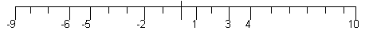

## 문제

In light of the forthcoming Balkan Olympic sailing cup in Rhodes Island, the organizing committee decided to come up with a new task for the competing boats to make the race even more mind-challenging. The committee placed a number of floating signs in a straight line, at various distances in the sea. All boats start concurrently from a specific point on this line and must visit all signs on the line. The race stops for each boat when all signs have been visited. To win, a boat must have visited all signs and covered the minimum sum of cumulative distances.

The cumulative distance of the first visited sign is the distance of the visited sign from the starting sign. The cumulative distance of all the rest visited signs is the distance from the previous sign plus the cumulative distance of the previous sign.

To help the crew understand the new race rules, the organizing committee labeled the starting sign as 0 (zero) and all other signs on the right of the starting sign with positive integers according to their distance from the starting sign. In the same manner, all signs on the left of the starting sign were given negative integer values according to their distance from the starting sign. Thus, if the signs are placed on the {-3,1,5} positions, then the sum of cumulative distances for the visiting order {-3,1,5} is 3+(4+3)+(4+7) = 21.

Your task is to write a program that (a) reads from the input file the sequence of signs based on their distances, (b) calculates the minimum sum of cumulative distances for some visiting order of the signs, and (c) writes the result to the file output.

For example, if the visiting order is {1, 3, 4, 10, -2, -5, -6, -9} the sum of cumulative distances is 1+3+4+10+ 22+25+26+29=120. The best order is {1, 3, 4, -2, -5, -6, -9, 10} with sum of cumulative distances 1+3+4+10+13+14+17+36=98.

## 입력

Your program should read the input from standard input. The first line of the file contains an integer L (where 1 ≤ L ≤ 200) representing the number of signs each boat must visit NOT including the starting sign. The second line contains the sequence of signs sorted in increasing order, excluding the starting sign. The range of distance of the signs is [-700, 700] and all distances are always integers.

## 출력

Your program should write the output into standard output containing only one positive integer for the minimum sum of cumulative distances covered by a boat for a selected visiting order .
