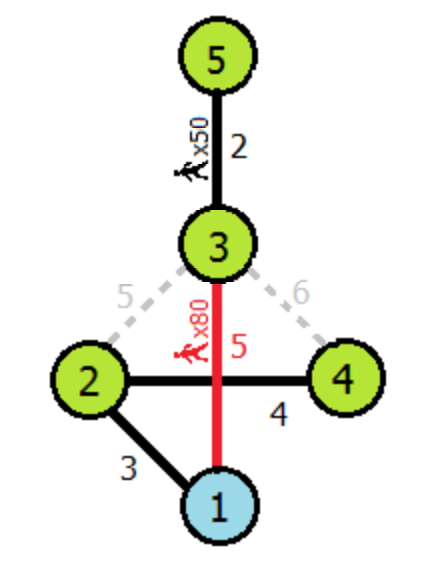

## 문제

Happyland can be described by a set of N towns (numbered 1 to N) initially connected by M bidirectional roads (numbered 1 to M). Town 1 is the central town. It is guaranteed that one can travel from town 1 to any other town through these roads. The roads are toll roads. A user of the road i has to pay a toll fee of ci cents to the owner of the road. It is known that all of these ci’s are distinct. Recently, K additional new roads are completed and they are owned by a billionaire Mr Greedy. Mr Greedy can decide the toll fees (not necessarily distinct) of the new roads, and he has to announce the toll fees tomorrow.

Two weeks later, there will be a massive carnival in Happyland! Large number of participants will travel to the central town and parade along the roads. A total of pj participants will leave from town j and travel toward the central town. They will only travel on a set of selected roads, and the selected roads will be announced a day before the event. By an old tradition, the roads are to be selected by the richest person in Happyland, who is Mr Greedy. Constrained by the same tradition, Mr Greedy must select a set of roads that minimizes the sum of toll fees in the selected set and yet at the same time allow anyone to travel from town j to town 1 (hence, the selected roads form a “minimum spanning tree” where the toll fees are the weights of the corresponding edges). If there are multiple such sets of roads, Mr Greedy can select any set as long as the sum is minimum.

Mr Greedy is well-aware that the revenue he received from the K new roads does not solely depends on the toll fees. The revenue from a road is actually the total fee collected from people who travel along the road. More precisely, if p people travel along road i, the revenue from the road i is the product cip. Note that Mr Greedy can only collect fees from the new roads since he does not own any of the old roads.

Mr Greedy has a sneaky plan. He plans to maximize his revenue during the carnival by manipulating the toll fees and the roads selection. He wants to assign the toll fees to the new roads (which are to be announced tomorrow), and select the roads for the carnival (which are to be announced a day before the carnival), in such a way that maximizes his revenue from the K new roads. Note that Mr Greedy still has to follow the tradition of selecting a set of roads that minimizes the sum of toll fees.

You are a reporter and want to expose his plan. To do so, you have to first write a program to determine how much revenue Mr Greedy can make with his sneaky plan.

## 입력

Your program must read from the standard input. The first line contains three space-separated integers N, M and K. The next M lines describe the initial M roads. The ith of these lines contains space-separated integers ai, bi and ci, indicating that there is a bidirectional road between towns ai and bi with toll fee ci. The next K lines describe the newly built K additional roads. The ith of these lines contains space-separated integers xi and yi, indicating that there is a new road connecting towns xi and yi. The last line contains N space-separated integers, the j-th of which is pj, the number of people from town j traveling to town 1.

The input also satisfies the following constraints.

* 1 ≤ N ≤ 100000.
* 1 ≤ K ≤ 20.
* 1 ≤ M ≤ 300000.
* 1 ≤ ci, pj ≤ 106 for each i and j.
* ci ≠ ci', if i ≠ i'.
* Between any two towns, there is at most one road (including newly built ones).

## 출력

Your program must write to the standard output a single integer, which is the maximum total revenue obtainable.

## 힌트

In this sample, Mr Greedy should set the toll fee of the new road (1,3) to be 5 cents. With this toll fee, he can select the roads (3,5), (1,2), (2,4) and (1,3) to minimize sum of toll fees, which is 14 cents. 30 people from town 3 and 50 people from town 5 will pass through the new road to town 1 and hence he can collect an optimal revenue of (30 + 50) × 5 = 400 cents.

If, on the other hand, the toll fee of the new road (1,3) is set to be 10 cents. Now, constrained by the tradition, Mr Greedy must select (3,5), (1,2), (2,4) and (2,3) as this is the only set that minimizes the sum of toll fees. Hence, no revenue will be collected from the new road (1,3) during the carnival.
