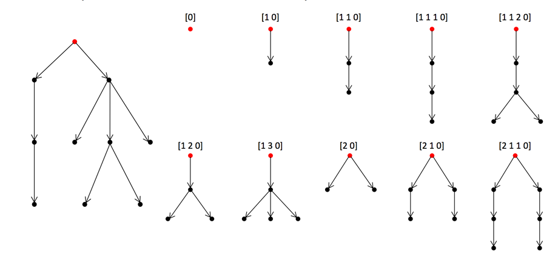

## 문제

유니폼 트리는 레벨이 같은 모든 노드가 같은 개수의 자식을 갖는 트리이다. 각 레벨별로 자식의 수가 모두 같기 때문에, 유니폼 트리는 각 레벨의 자식의 수로 이루어진 정수 리스트로 나타낼 수 있다.

예를 들어, [2 3 5 0]은 루트의 자식 수가 2이고, 그 자식은 자식을 셋 갖고, 손자는 자식을 다섯 갖고, 증손자는 자식이 없는 트리를 나타낸다.

서브트리는 항상 트리의 루트를 포함해야 한다.

트리의 정보가 주어졌을 때, 그 트리가 갖는 서로 다른 유니폼 서브트리의 개수를 구하는 프로그램을 작성하시오. 아래 그림의 왼쪽은 트리이고, 오른쪽은 그 트리가 갖는 모든 유니폼 서브트리이다.

## 입력

입력은 여러 개의 테스트 케이스로 이루어져 있다. 각 테스트 케이스는 트리 하나를 나타내며, 문자열로 주어진다.

문자열은 여는 괄호와 닫는 괄호로 이루어져 있다. 대응하는 괄호는 노드를 나타내고, 그 사이에 들어있는 노드는 자식을 나타낸다.

노드의 개수는 4,000개를 넘지 않으며, 주어지는 문자열에 괄호를 제외한 다른 문자는 없다.

입력의 마지막 줄에는 0이 하나 주어진다.

## 출력

각 테스트 케이스마다, 입력으로 주어진 트리의 서로 다른 유니폼 서브트리를 한 줄에 하나씩 출력한다.

출력은 문제에서 설명한 것과 같이 리스트로 나타내는 방법을 사용하며, 각 숫자 사이에는 공백을 한 칸 출력한다.

리스트는 사전순으로 출력한다.

## 힌트

첫 번째 테스트 케이스는 문제의 그림과 같은 트리이다.
