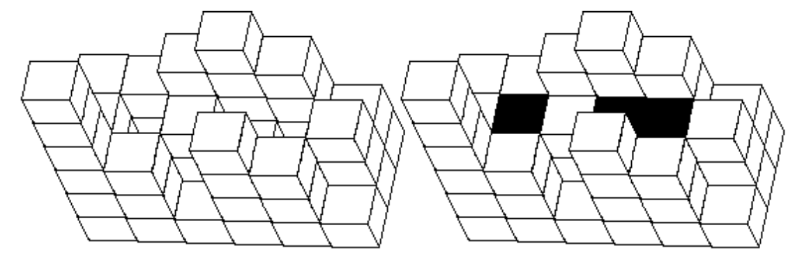

## 문제

A long time ago the construction of swimming pools was done thus: first, a rectangular area of length m meters and width n meters was designated. This area was then divided to 1\*1 meter sized squares, thus obtaining m\*n cells. Then either a perfectly cut granite cube with side length equal to 1, or a tower of these perfect cubes was placed in each cell.

The cubes were so perfectly made that it was sufficient for two cubes to have their egdes next to each other so that this place would be hermetically sealed (water would not flow through).

When water was flowing, such a “set of cubes” could only hold a limited amount of water.

Your task is to write a program, which would determine the maximum possible volume of water in cubic meters that can be gathered in this pool.

## 입력

The first line of the standard input contains two positive integers m and n, which are the lengths of sides of the rectangular area in meters (0<m, n≤100).

The next of the m lines in the file contain each n natural numbers.

The j-th number in the i+1-st line of the file shows the height of the cube tower located in the i-th row of the j-th column (or number of cubes positioned there). It is given that there is at least one cube in each cell and that the height of the tower does not exceed 10000 in any of the cells.

## 출력

The only line of the standard output must contain one positive integer – the maximum possible volume of water in cubic meters that can be stored in the given swimming pool.

## 힌트

A view from the top of an empty pool and of a filled pool given in the pictures below.

