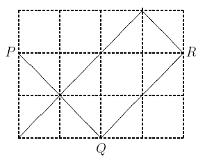

## 문제

Attending a boring weekly session, our professor started drawing on a grid in a page of his calendar. He started at a boundary grid point P ; note that P is a corner of one or two grid cells. He drew a diameter of one of those cells and continued on a straight line until reaching point Q on another edge of the grid. Then he started another line from Q , perpendicular to the line PQ until hitting another edge at point R . He kept drawing lines as above, until he could not draw a new line, either because a perpendicular line would not start with a cell diameter or it would fall on an already drawn line. Then he was puzzling how he would be able to count the number of minimal rectangles he has created on the grid. At this time, the chair of the session noticed him and asked him what he was doing. ``Sorry, I was designing a problem for the ACM-ICPC Tehran site," he said.

  
You are to write a program to, given the dimensions R and C of a grid, the coordinates x and y of a point P on one of the edges of the grid, and the direction (up, left), (down, left), (up, right), or (down, right) of the first line, help the professor to find out the number of minimal rectangles.

## 입력

The input file contains multiple test cases. The first line of the input, contains t , the number of test cases that follow. Each of the following t blocks, describes a test case.

The first line of each block, contains two positive integers R and C , which are the number of horizontal and vertical gridlines, respectively (2 ≤ R, C ≤ 1000) . The coordinates of the starting point comes on the next line, as two positive integers y and x , (1 ≤ y ≤ R, 1 ≤ x ≤ C) ; for the upper-left point of the grid, we have x = y = 1 . The third line of each test case, contains a two-character code which is one of the following:

* ``DR", the first move is in the down-right direction,
* ``DL", the first move is in the down-left direction,
* ``UL", the first move is in the up-left direction,
* ``UR", the first move is in the up-right direction.

## 출력

For each test case, output one line containing the number of non-overlapping rectangles formed.
