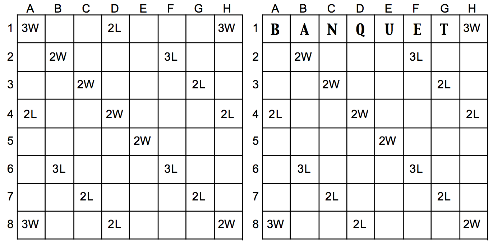

## 문제

Scrabble is a word game which has now sold in excess of 100 million sets in 121 countries and 29 languages. The game is played by placing tiles, each of which is inscribed with a letter, on a board, according to some simple rules, which we will not bother about now. The values of the tiles in the English version are:

10: Q, Z  
8: J, X  
5: K  
4: F, H, V, W, Y  
3: B, C, M, P  
2: D, G  
1: A, E, I, L, N, O, R, S, T, U

The board consists of a 15×15 grid of squares. Some of these squares are coloured and there is a bonus for using them. Letter bonus squares (2L, 3L) multiply the value of the letter placed on them by two or three respectively; word bonus squares (2W, 3W) multiply the score of the entire word (after any relevant letter multipliers) by two or three respectively. Thus if I had placed the word ‘BANQUET’ as shown on the right of the figure below then I would score 84 (3+1+1+10\*2+1+1+1)\*3. If I had played ‘BANQUETS’ starting in the same place I would have scored 261 (3+1+1+2\*10+1+1+1+1)\*3\*3.

Bonus squares are shown below for the top left quadrant of the board and are symmetrically placed on the rest of the board, i.e. the board is reflected about column H and row 8.

A play is denoted by specifying a starting position and orientation (row, column for horizontal words and column, row for vertical words) and the word. In actual play one would also need to worry about tiles already on the board, blank tiles, tiles in adjacent squares, bonus points for playing all the letters on your rack and so on, but we will ignore those details for this problem.

## 입력

Input will consist of a series of lines, each denoting a play. Each line will start with the designation of the starting position of the word followed by a space and the word itself — a sequence of 2 to 15 upper case letters. The placement of the word will be such that it will fit on the board. Rows will be designated by a number in the range 1 to 15, columns by an upper case letter in the range ‘A’ to ‘O’. If the row is specified first then the word is played horizontally, if the column is specified first then the word is played vertically. The sequence of plays will be terminated by a line containing a single ‘#’.

## 출력

Output will consist of one line for each play in the input, consisting of the play itself, followed by a space and the score for that play, as outlined above.
