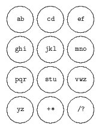
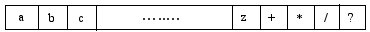

## 문제

Optimus Mobiles produces mobile phones that support SMS messages. The Mobiles have a keypad of 12 keys, numbered 1 to 12. There is a character string assigned to each key. To type in the n-th character in the character string of a particular key, one should press the key n times. Optimus Mobiles wishes to solve the problem of assigning character strings to the keys such that for typing a random text out of a dictionary of common words, the average typing effort (i.e. the average number of keystrokes) is minimal.

Figure 1

To be more precise, consider a set of characters {a, b, c,..., z, +, \*, /, ?} printed on a label tape as in Fig. 2. We want to cut the tape into 12 pieces each containing one or more characters. The 12 labels are numbered 1 to 12 from left to right and will be assigned to the keypad keys in that order.

  
Figure 2

You are to write a program to find the 11 cutting positions for a given dictionary of common words. The cutting positions should minimize the average number of keystrokes over all common words in the dictionary. Your output should be a string of 11 characters, where character i in this string is the first character of the (i + 1)-th label.

## 입력

The first line contains a single integer t ( 1 ≤ t ≤ 10), the number of test cases. Each test case starts with a line, containing an integer M ( 1 ≤ M ≤ 10000), the number of common words in the test case. In each M subsequent line, there is a common word. Each common word contains at most 30 characters from the alphabet {a, b, c, ..., z, +, \*, /, ?}.

## 출력

The output contains one line per test case containing an optimal cut string. Obviously, there may be more than a single optimal cut string, so print the optimal cut string which is the smallest one in lexicographic order.
