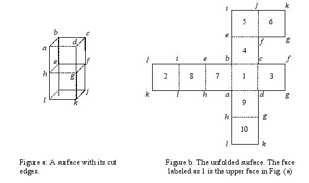

## 문제

Ramtung, the senior Ph.D. student, has to propose a problem for the ACM programming contest this year. As he is highly involved in his Ph.D. studies, he cannot think about anything outside his research area; all about shortest paths in computational geometry.  
One of the problems in this area is to find the shortest path between two given points on the surface of a polyhedron. A technique that helps finding such paths is unfolding. We cut the surface of the polyhedron along some line segments such that it can be unfolded onto a common plane. This flat surface allows us to apply more simple techniques to find the desired path. In the unfoldung problem (named after its author, Ramtung) you are to find whether the surface of a given polyhedron can be unfolded into a common plane when cut along a number of its edges.

To simplify your task, we consider as input the outer surface of a solid object composed of unit cubes glued to each other on their faces such that each cube is adjacent to at least one other cube (unless the object consists of a single cube). We say two cubes are adjacent if they have exactly one face in common. We want to unfold the outer surface of the object (i.e., we ignore the faces that are glued) to obtain a flat layout. The input to the problem is the description of the outer surface as well as a number of unit-edges of the surface that are to be cut. For the sake of simplicity, you may assume that the given object is such that every edge of the outer surface is adjacent to exactly two faces of the outer surface.

For example, Fig. a and Fig. b show how the outer surface of two glued cubes is unfolded onto a common plane. In Fig. a, dotted edges are uncut, and solid lines show the ones that are cut. Note that the face efgh is not part of the outer surface. The input data to this example is given in the first sample input. (The numbers inside faces of the right layout (Fig. b) are used to identify faces in the sample input data.)

You are to write a program to determine whether such a surface can be laid out onto a common plane after unfolding its faces. By unfolding we mean rotating a face around one of its edges until it becomes co-planar with the other face adjacent to that edge (so the angle made between the faces inside the surface will be 180o). Note that it is possible for the layout obtained after unfolding to overlap. If possible, one can rotate more than one face together.

## 입력

The first line of the input file contains a single integer t ( 1 ≤ t ≤ 10), the number of test cases, followed by the input data for each test case. The first line of each test case contains a single integer f ( 6 ≤ f ≤ 10000) which is the number of faces on the outer surface. Assume that the faces are numbered uniquely from 1 to f. The second line contains integer n, which is the number of unit edges between faces of the outer surface, followed by exactly n lines each containing a string of the form x + y or x - y forms. x and y are distinct integers ( 1 ≤ x, y ≤ f) representing two faces of the surface. Both forms specify face x is adjacent to face y along a common edge. The plus sign shows that the edge common to x and y is cut (solid lines in Fig. a) and the minus sign indicates that the edge is not cut (dotted lines). There is no blank character in a line and there are no empty lines in the input.

## 출력

There should be one line per test case containing a string indicating the output to the test case. The output should be the string `CAN UNFOLD' if one can unfold the given surface, `CANNOT UNFOLD' if the surface cannot be unfolded, and `DISCONNECTED' if the surface is separated into two or more pieces by the cut edges. Note that if the surface is disconnected, your output should be `DISCONNECTED' regardless of whether it can be unfolded or not. Be careful that the output is considered case sensitive.
