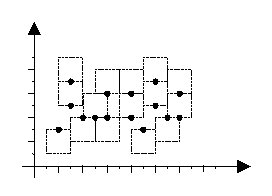

## 문제

Map generation is a difficult task in cartography. A vital part of such task is automatic labeling of the cities in a map; where for each city there is text label to be attached to its location, so that no two labels overlap. In this problem, we are concerned with a simple case of automatic map labeling.

Assume that each city is a point on the plane, and its label is a text bounded in a square with edges parallel to x and y axis. The label of each city should be located such that the city point appears exactly in the middle of the top or bottom edges of the label. In a good labeling, the square labels are all of the same size, and no two labels overlap, although they may share one edge. Figure 1 depicts an example of a good labeling (the texts of the labels are not shown.)

Given the coordinates of all city points on the map as integer values, you are to find the maximum label size (an integer value) such that a good labeling exists for the map.

## 입력

The first line contains a single integer t ( 1 ≤ t ≤ 10), the number of test cases. Each test case starts with a line containing an integer m ( 3 ≤ m ≤ 100), the number of cities followed by m lines of data each containing a pair of integers; the first integer (X) is the x and the second one (Y) is the y coordinates of one city on the map ( -10000 ≤ X, Y ≤ 10000). Note that no two cities have the same (x, y) coordinates.

## 출력

The output will be one line per each test case containing the maximum possible label size (an integer value) for a good labeling.
