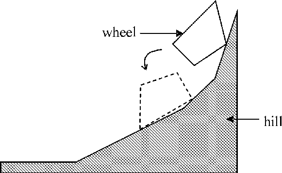

## 문제

The village's carpentry is located by a hill side. The carpenter's two little boys play with a piece of wood which looks like a deformed wheel with two identical convex polygon-shaped faces. One boy sets the wooden wheel on a slope at the hill top and let it roll down. The other boy is to quickly place himself at where he guesses the rolling wood would stop. Your program is to help him make the right guess.

More formally, we consider the wooden wheel as a simple convex polygon and we approximate the hill by a sequence of connected line segments with decreasing slopes. The slope of the last segment in the sequence is assumed to be zero, and the slope of the first segment is assumed to be a positive number. Initially, the wheel is placed on the hill such that there is at least one point of contact between the wheel and segments. For example in the following figure, the wheel in its initial position is drawn in solid lines, while the final position is drawn in dashed lines.

  
At any instant, the wheel rotates around one of its vertices, say P, if the y-coordinate of its center of gravity is decreased (note that this condition is necessary at any instant during the motion). It can be easily shown that at any instant, there is at most one such vertex. Rotation around P is stopped when the wheel touches a segment. The motion continues until no vertex can be found such that the wheel can rotate around it. At any instant, assume that changing the position of the center of gravity in any direction for at most 10-5 units, does not affect the stability of the wheel. Also assume that the friction between the wheel and the surface of the hill is so high that the wheel never slides on the surface.

## 입력

The first line of the input file contains a single integer t ( 1 ≤ t ≤ 10), the number of test cases, followed by the input data for each test case. In the first line of each test case there is an integer n ( 1 ≤ n ≤ 10), that indicates the number of the wheel wheel vertices. In each of the next n lines, there is a pair of numbers which are x and y coordinates of the initial position of a vertex. After this, there is a single line containing the initial x and y coordinates of the center of gravity of the wheel. You can assume that the center of gravity is inside or on the boundary of the polygon (note that the given center of gravity is not necessarily computable from wheel's geometric shape). Next lines of the test data will describe the shape of the hill. The surface of the hill is approximated with a series of line segments with decreasing slopes ending with a horizontal line segment. For each segment, there is a line containing length and slope of a segment (both of them are real numbers). The lines are ordered in decreasing slope (The last line of this part of the input has slope zero). You can assume that the last (horizontal) line is long enough that the wheel would not pass its end. In the last line of the test case, there is a line containing the x and y coordinates of the right end-point of the first segment. All coordinates and slopes are real numbers.

## 출력

For each test case, there should be a single line in the output file, containing two numbers which are x and y coordinates of the wheel's center of gravity. Round the numbers in the output to 3 digits after decimal point.
