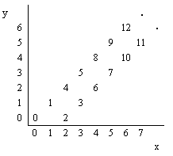

## 문제

Starting from point (0,0) on a plane, we have written all non-negative integers 0,1,2,... as shown in the figure. For example, 1, 2, and 3 has been written at points (1,1), (2,0), and (3,1) respectively and this pattern has continued.

You are to write a program that reads the coordinates of a point (x, y), and writes the number (if any) that has been written at that point. (x, y) coordinates in the input are in the range 0...5000.

## 입력

The first line of the input is N, the number of test cases for this problem. In each of the N following lines, there is x, and y representing the coordinates (x, y) of a point.

## 출력

For each point in the input, write the number written at that point or write "No Number" if there is none.
