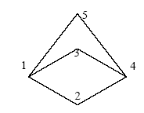

## 문제

Discovery Co. ltd. builds a satellite using a new kind of an intelligent camera. The camera has special software to detect cities and roads from an image, and is also able to detect every region (which is a connected part of surface), bounded by a series of connected roads with no other region inside. Using this technology, the satellite is able to compress the picture before sending it. The compressed format of a picture is the city locations and its regions.

Discovery has launched the satellite, without testing the software completely. So, after a while, they received some buggy pictures which includes one more extra region: the outer region. The outer region is the region of the plane enclosing every other region (which has infinite area). Further analysis shows that all images sent have the following properties:

1. All cities, in the image, have at least two roads to the other cities.
2. There is a path connecting every pair of cities.
3. There is at most one road between each pair of cities.
4. Roads do not cross each other except at the cities.

The above Figure shows a sample image received (see sample input).

You are to write a program to read a buggy image and report the outer region.

## 입력

The first line of the input consists of a single integer N (1 ≤ N ≤ 20), which is the number of test cases. The test cases appear with no blank lines in between. The first line of each test case consists of the number of cities (between 1 and 50) followed by pairs of integers (x, y) which are location of cities (each pair in one line), followed by number of faces in a separate line (between 1 and 50), followed by face information on each line. Face information consists of number of cities making the face and the city numbers in clockwise (or counterclockwise) order.

## 출력

There should be a single line containing the boundary face number for each test case, with no blank lines in between.
