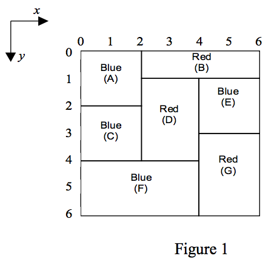

## 문제

The CE digital company has built an Automatic Painting Machine (APM) to paint a flat board fully covered by adjacent non-overlapping rectangles of different sizes each with a predefined color.

  
To color the board, the APM has access to a set of brushes. Each brush has a distinct color C. The APM picks one brush with color C and paints all possible rectangles having predefined color C with the following restrictions:

To avoid leaking the paints and mixing colors, a rectangle can only be painted if all rectangles immediately above it have already been painted. For example rectangle labeled F in Figure 1 is painted only after rectangles C and D are painted. Note that each rectangle must be painted at once, i.e. partial painting of one rectangle is not allowed.

You are to write a program for APM to paint a given board so that the number of brush pick-ups is minimum. Notice that if one brush is picked up more than once, all pick-ups are counted.

## 입력

The first line of the input file contains an integer M which is the number of test cases to solve (1 ≤ M ≤ 10). For each test case, the first line contains an integer N, the number of rectangles, followed by N lines describing the rectangles. Each rectangle R is specified by 5 integers in one line: the y and x coordinates of the upper left corner of R, the y and x coordinates of the lower right corner of R, followed by the color-code of R.

Note that:

1. Color-code is an integer in the range of 1 .. 20.
2. Upper left corner of the board coordinates is always (0,0).
3. Coordinates are in the range of 0 .. 99.
4. N is in the range of 1..15.

## 출력

One line for each test case showing the minimum number of brush pick-ups.
