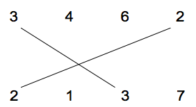
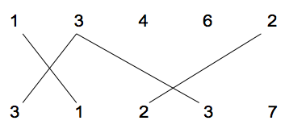

## 문제

There are two rows of positive integer numbers. We can draw one line segment between any two equal numbers, with values r, if one of them is located in the first row and the other one is located in the second row. We call this line segment an r-matching segment. The following figure shows a 3-matching and a 2-matching segment.

We want to find the maximum number of matching segments possible to draw for the given input, such that:

1. Each a-matching segment should cross exactly one b-matching segment, where a ≠ b .
2. No two matching segments can be drawn from a number. For example, the following matchings are not allowed.

Write a program to compute the maximum number of matching segments for the input data. Note that this number is always even.

## 입력

The first line of the file is the number M, which is the number of test cases (1 ≤ M ≤ 10). Each test case has three lines. The first line contains N1 and N2, the number of integers on the first and the second row respectively. The next line contains N1 integers which are the numbers on the first row. The third line contains N2 integers which are the numbers on the second row. All numbers are positive integers less than 100.

## 출력

Output file should have one separate line for each test case. The maximum number of matching segments for each test case should be written in one separate line.
