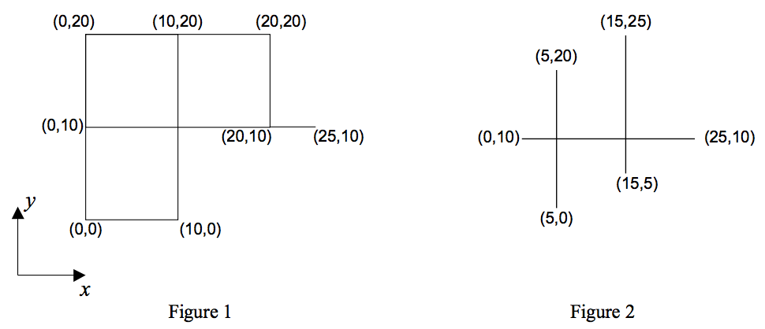

## 문제

We are given a figure consisting of only horizontal and vertical line segments. Our goal is to count the number of all different rectangles formed by these segments. As an example, the number of rectangles in the Figures 1 and 2 are 5 and 0 respectively.

There are many intersection points in the figure. An intersection point is a point shared by at least two segments. The input line segments are such that each intersection point comes from the intersection of exactly one horizontal segment and one vertical segment.

## 입력

The first line of the file contains a single number M, which is the number of test cases in the file (1 ≤ M ≤ 10), and the rest of the file consists of the data of the test cases. Each test case begins with a line containing s (1 ≤ s ≤= 100), the number of line segments in the figure. It follows by s lines, each containing x and y coordinates of two end points of a segment respectively. The coordinates are integers in the range of 0 to 1000.

## 출력

The output for each test case is the number of all different rectangles in the figure described by the test case. The output for each test case must be written on a separate line.
