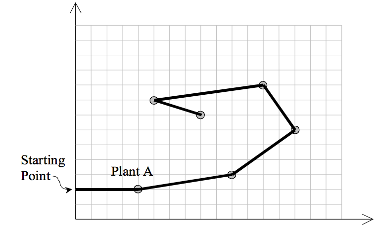

## 문제

The most exciting space discovery occurred at the end of the 20th century. In 1999, scientists traced down an ant-like creature in the planet Y1999 and called it M11. It has only one eye on the left side of its head and just three feet all on the right side of its body and suffers from three walking limitations:

1. It can not turn right due to its special body structure.
2. It leaves a red path while walking.
3. It hates to pass over a previously red colored path, and never does that.

The pictures transmitted by the Discovery space ship depicts that plants in the Y1999 grow in special points on the planet. Analysis of several thousands of the pictures have resulted in discovering a magic coordinate system governing the grow points of the plants. In this coordinate system with x and y axes, no two plants share the same x or y.

An M11 needs to eat exactly one plant in each day to stay alive. When it eats one plant, it remains there for the rest of the day with no move. Next day, it looks for another plant to go there and eat it. If it can not reach any other plant it dies by the end of the day. Notice that it can reach a plant in any distance.

The problem is to find a path for an M11 to let it live longest.

Input is a set of (x, y) coordinates of plants. Suppose A with the coordinates (xA, yA) is the plant with the least ycoordinate. M11 starts from point (0,yA) heading towards plant A. Notice that the solution path should not cross itself and all of the turns should be counter-clockwise. Also note that the solution may visit more than two plants located on a same straight line.

## 입력

The first line of the file is M, the number of test cases to be solved (1 ≤ M ≤ 10). For each test case, the first line is N, the number of plants in that test case (1 ≤ N ≤ 50), followed by N lines for each plant data. Each plant data consists of three integers: the first number is the unique plant index (1..N), followed by two positive integers x and y representing the coordinates of the plant. Plants are sorted by the increasing order on their indices in the input file. Suppose that the values of coordinates are at most 100.

## 출력

Output file should have one separate line for the solution of each test case. A solution is the number of plants on the solution path, followed by the indices of visiting plants in the path in the order of their visits.
