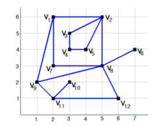

## 문제

We have a map for farming land in a country. The whole farming land of the country is divided into a set of disjoint farming regions. Each farmer owns only one farming region in this country. There is a boundary fence between two neighboring farming regions. The farmland map for this country can be represented in a plane graph. The following Figure-1 shows one example.

Figure-1: Farmland graph G(V,E)

There are two types of edges, boundary edge and non-boundary edge. All edges of G(V,E) except (v8, v6) and (v11, v10) are boundary edges which are between two neighboring farming regions. The "proper farming region" in a Farmland graph is a closed region bounded by a simple cycle and it should not contain any vertices or edges inside. In this figure, the polygon <v1,v9,v8,v7 > is a proper farming region, and the region <v2, v1, v7, v8 , v2, v5, v4, v3 > is not a proper farming region since its boundary cycle is not simple.

We assume that the farmland graph G(V,E) is a simple connected graph, which does not allow self-loops (Figure-2 (a)) and parallel edges (Figure-2 (b)). Also in Farmland graph G(V,E), we do not consider the outer face of G(V,E). You can see that there are 2 proper farming regions in G(V,E) shown in Figure-1, namely <v1,v9,v8,v7> and <v2,v3,v4,v5>, since there are no vertices or edges inside. But the polygon<v1,v7,v8,v2> is not a proper farming region since vertex v3, v4, and v5 are located in that region. Similarly, the region <v9,v11,v12,v8> is not a proper region because a vertex v10 is inside the region. A degenerate polygon <v6, v8> is not a proper region because it has no valid area inside.

Figure-2: (a) self-loop <v1,v1> , and (b) 3 parallel edges { <v1,v2>, <v1,v2>, <v1,v2> }

There are other assumptions for input farmland graph data.

1. There is at least one proper farming region.
2. The position of each vertex in Farmland graph is distinct.
3. There is no edge crossing, which means the graph G(V,E) is a plane graph.
4. Farmland graph G(V,E) is simple and connected.

Let us define the "size" of proper farming region. The size of proper farming region is the number of boundary edges of that region. For example, the size of the proper farming region <v2,v3,v4,v5 > is 4.

The problem is to find the number of proper regions that have a specified size. If you are requested to find the number of proper regions with size of 4 in the graph given in Figure-1, you must answer that there are 2 proper regions whose sizes are 4 because farming regions < v1,v9,v8,v7 > and <v2,v3,v4,v5 > are proper regions and their sizes are 4. If there are no such regions, then you have to print 0.

## 입력

The input file consists of M test cases. The first line of the input file contains a positive integer M, the number of test cases you are to solve. After the first line, input data for M cases follow. The first line of each test case contains a positive integer N ( ≥ 3), the number of vertices. Each of the following N lines is of the form:

i xi yi di a1 a2 a3 ..... adi

"i" is the vertex number, xi and yi are the coordinate (xi, yi) of the vertex i, and di is the degree of the vertex i. The following { ai } are the adjacent vertices of the vertex i. The last line gives k, the size of proper regions that you have to count.

Note that M, the number of cases in input file is less than 10. N, the number of vertices of a given farmland graph is less than 200. All vertices are located on grid points of the 1000 x 1000 lattice grid.

## 출력

The output must contain M non-negative integers. Each line contains the answer n to the corresponding case of the input file.
