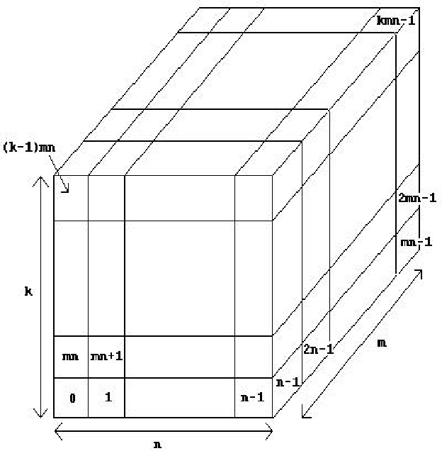

## 문제

Roger Wilco is in charge of the design of a low orbiting space station for the planet Mars. To simplify construction, the station is made up of a series of Airtight Cubical Modules (ACM's), which are connected together once in space. One problem that concerns Roger is that of (potentially) lethal bacteria that may reside in the upper atmosphere of Mars. Since the station will occasionally fly through the upper atmosphere, it is imperative that extra shielding be used on all faces of the ACMs which make up the external surface of the station. Roger has made certain that where two ACMs touch, either edge-to-edge or face-to-face, that joint is sealed so no bacteria can sneak through. Any face of an ACM shared by another ACM will not need shielding, of course, nor will a face which cannot be reached from the outside. Roger could just put extra shielding on all of the faces of every ACM, but the cost would be prohibitive. Therefore, he wants to know the exact number of ACM faces which need the extra shielding.

## 입력

Input consists of multiple problem instances. Each instance consists of a specification of a space station. We assume that each space station can fit into an n×m×k grid ( 1 ≤ n, m, k ≤ 60), where each grid cube may or may not contain an ACM. We number the grid cubes 0, 1, 2,..., kmn - 1 as shown in the diagram below. Each space station specification then consists of the following: the first line contains four positive integers n m k l, where n, m and k are as described above and l is the number of ACM's in the station. This is followed by a set of lines which specify the l grid locations of the ACM's. Each of these lines contain 10 integers (except possibly the last). Each space station is fully connected (i.e., an astronaut can move from one ACM to any other ACM in the station without leaving the station). Values of n = m = k = l = 0 terminate input.

## 출력

For each problem instance, you should output one line of the form

The number of faces needing shielding is s.

where s is for you to determine.
