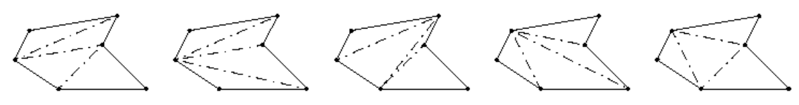

## 문제

Triangulation of surfaces has applications in the Finite Element Method of solid mechanics. The objective is to estimate the stress and strain on complex objects by partitioning them into small simple objects which are considered incompressible. It is convenient to approximate a plane surface with a simple polygon, i.e., a piecewise-linear, closed curve in the plane on m distinct vertices, which does not intersect itself. A chord is a line segment between two non-adjacent vertices of the polygon which lies entirely inside the polygon, so in particular, the endpoints of the chord are the only points of the chord that touch the boundary of the polygon. A triangulation of the polygon, is any choice of m − 3 chords, such that the polygon is divided into triangles. In a triangulation, no two of the chosen chords intersect each other, except at endpoints, and all of the remaining (unchosen) chords cross at least one of the chosen chords. Fortunately, finding an arbitrary triangulation is a fairly easy task, but what if you were asked to find the best triangulation according to some measure?

Figure I.1: Five out of nine possible triangulations of the example polygon. The leftmost has the smallest largest triangle.

## 입력

On the first line of the input is a single positive integer n, telling the number of test scenarios to follow. Each scenario begins with a line containing one positive integer 2 < m < 50, being the number of vertices of the simple polygon. The following m lines contain the vertices of the polygon in the order they appear along the border, going either clockwise or counter clockwise, starting at an arbitrary vertex. Each vertex is described by a pair of integers x y obeying 0 ≤ x ≤ 10000 and 0 ≤ y ≤ 10000.

## 출력

For each scenario, output one line containing the area of the largest triangle in the triangulation of the polygon which has the smallest largest triangle. The area should be presented with one fractional decimal digit.
