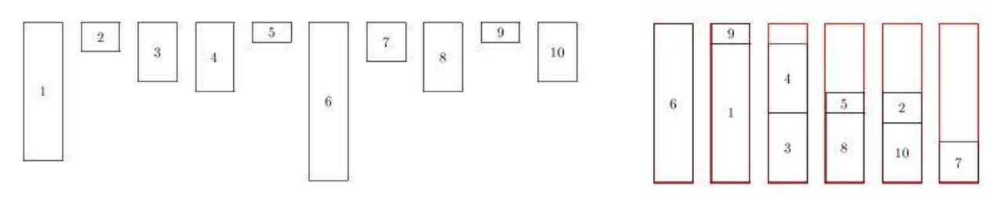

## 문제

A set of n 1-dimensional items have to be packed in identical bins. All bins have exactly the same length l and each item i has length li ≤ l. We look for a minimal number of bins q such that

* each bin contains at most 2 items,
* each item is packed in one of the q bins,
* the sum of the lengths of the items packed in a bin does not exceed l.

You are requested, given the integer values n, l, l1, . . . , ln, to compute the optimal number of bins q.

## 입력

The input begins with a single positive integer on a line by itself indicating the number of the cases following, each of them as described below. This line is followed by a blank line, and there is also a blank line between two consecutive inputs.

The first line of the input file contains the number of items n (1 ≤ n ≤ 105). The second line contains one integer that corresponds to the bin length l ≤ 10000. We then have n lines containing one integer value that represents the length of the items.

## 출력

For each test case, your program has to write the minimal number of bins required to pack all items.

The outputs of two consecutive cases will be separated by a blank line.

Note: The sample instance and an optimal solution is shown in the figure below. Items are numbered from 1 to 10 according to the input order.

