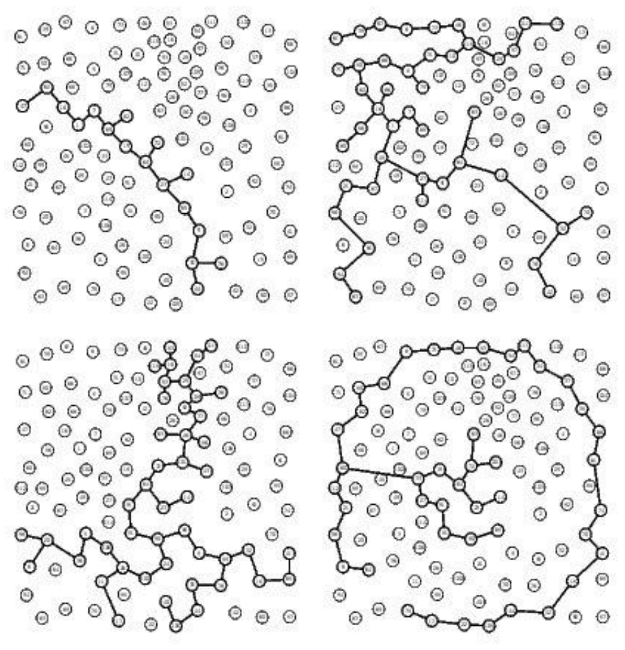
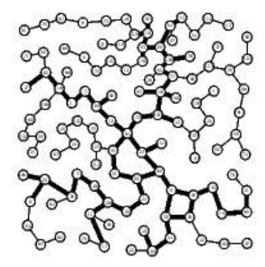
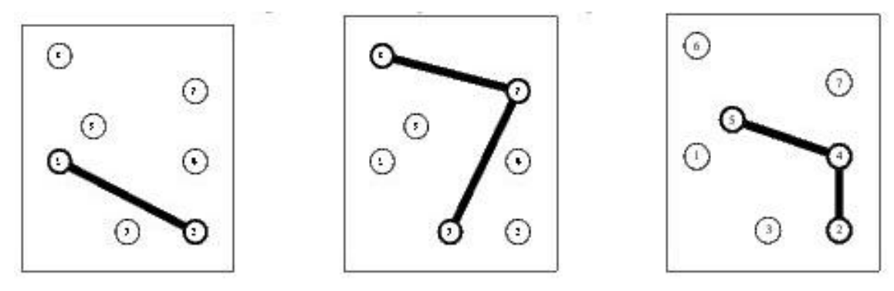
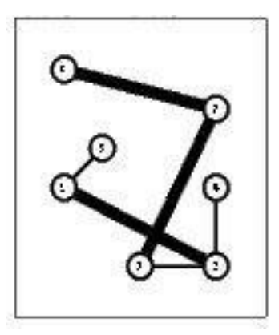

## 문제

World Wide Networks (WWN) is a leading company that operates large telecommunication networks. WWN would like to setup a new network in Borduria, a nice country that recently managed to get rid of its military dictator Kurvi-Tasch and which is now seeking for investments of international companies (for a complete description of Borduria, have a look to the following Tintin albums “King Ottokar’s Sceptre”, “The Calculus Affair” and “Tintin and the Picaros”). You are requested to help WWN todecide how to setup its network for a minimal total cost.

There are several local companies running small networks (called subnetworks in the following) that partially cover the n largest cities of Borduria. WWN would like to setup a network that connects all n cities. To achieve this, it can either build edges between cities from scratch or it can buy one or several subnetworks from local companies. You are requested to help WWN to decide how to setup its network for a minimal total cost.

* All n cities are located by their two-dimensional Cartesian coordinates.
* There are q existing subnetworks. If q ≥ 1 then each subnetwork c (1 ≤ c ≤ q) is defined by a set of interconnected cities (the exact shape of a subnetwork is not relevant to our problem).
* A subnetwork c can be bought for a total cost wc and it cannot be split (i.e., the network cannot be fractioned).
* To connect two cities that are not connected through the subnetworks bought, WWN has to build an edge whose cost is exactly the square of the Euclidean distance between the cities.

You have to decide which existing networks you buy and which edges you setup so that the total cost is minimal. Note that the number of existing networks is always very small (typically smaller than 8).

## 입력

The input begins with a single positive integer on a line by itself indicating the number of the cases following, each of them as described below. This line is followed by a blank line, and there is also a blank line between two consecutive inputs.

Each test case is described by one input file that contains all the relevant data. The first line contains the number n of cities in the country (1 ≤ n ≤ 1000) followed by the number q of existing subnetworks (0 ≤ q ≤ 8). Cities are identified by a unique integer value ranging from 1 to n. The first line is followed by q lines (one per subnetwork), all of them following the same pattern: The first integer is the number of cities in the subnetwork. The second integer is the the cost of the subnetwork (not greater than 2 × 106). The remaining integers on the line (as many as the number of cities in the subnetwork) are the identifiers of the cities in the subnetwork. The last part of the file contains n lines that provide the coordinates of the cities (city 1 on the first line, city 2 on the second one, etc). Each line is made of 2 integer values (ranging from 0 to 3000) corresponding to the integer coordinates of the city.

## 출력

For each test case, your program has to write the optimal total cost to interconnect all cities. The outputs of two consecutive cases will be separated by a blank line.

A 115 Cities Instance

Consider a 115 cities instance of the problem with 4 subnetworks (the 4 first graphs in Figure 1). As mentioned earlier the exact shape of a subnetwork is not relevant still, to keep figures easy to read, we have assumed an arbitrary tree like structure for each subnetworks. The bottom network in Figure 1 corresponds to the solution in which the first and the third networks have been bought. Thin edges correspond to edges build from scratch while thick edges are those from one of the initial networks.

Figure 1: A 115 Cities Instance and a Solution (Buying the First and the Third Network)

## 힌트

The sample input instance is shown in Figure 2. An optimal solution is described in Figure 3 (thick edges come from an existing network while thin edges have been setup from scratch).

Figure 2: The 7 City instance of the sample input

An optimal solution of the 7 City instance in which which the first and second existing networkshave been bought while two extra edges (1,5) and (2,4) have been setup

Figure 3
