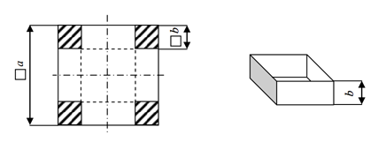

## 문제

꿍은 미래의 여자친구에게 선물을 주기 위해 a×a 사이즈의 판자를 이용해 미리 선물상자를 만들려고 한다. 이 선물상자는 밑면이 정사각형이어야 하며 맨 위는 뚫려있어야 한다. 선물상자는 아래와 같이 두 가지 단계를 거쳐 만들어진다. 먼저 각 꼭짓점에서 bxb 사이즈의 정사각형모양으로 판자를 잘라낸 후, 직사각형 모양의 판자를 수직으로 세워 붙인다.

꿍은 미래의 여자친구에게 최대한 큰 부피의 선물을 주고싶어한다. 따라서 여러분은 꿍이 가장 큰 부피의 선물상자를 만들 수 있도록 선물상자의 부피가 최대가 되게하는 높이 b를 찾아야 한다.

## 입력

첫째 줄은 테스트케이스의 개수인 n (1≤n≤10)이 주어진다. 다음 n줄에는 각각 판자의 모서리 길이인 a(1≤a≤1024)가 실수형태로 주어진다.

## 출력

각 테스트 케이스에 대해 선물상자의 부피가 최대가 되게 하는 b의 값을 소수점 아래 10자리까지 나타내어라.

## 힌트

이 문제를 풀고 시간이 남는다면 꿍이 여자친구도 찾을 수 있도록 도와주어라.
