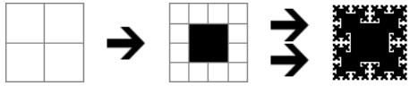

## 문제

Fyodor celebrates his birthday today. Before the guests come he decorates a cake with chocolate cream in a special way. At the beginning cake looks like a square divided into **4** equal white square parts. Fyodor calls fractalization the following sequence of actions. All the little squares of cake get united into groups of **2**x**2** so that there are no ungrouped fragments. After that each small square is divided into **4** equal squares so that group of **2**x**2** becomes a group of **4**x**4**. As the last action **4** squares in the middle of each group are filled with chocolate. Fyodor does not stop at one fractalization and repeats it **N** times, even when he has to use a microscope. Illustration below shows the initial cake, first fractalization result, and the cake after the fifth fractalization:

Now Fyodor wants to cut pieces of cake with beautiful patterns for guests, but it is difficult to assess beauty of a piece looking at the whole cake. Fyodor wants a program that will quickly show the pattern of rectangular part of the cake.

## 입력

Single line at the input contains five non-negative integers: **N**, **R1**, **R2**, **C1**, **C2**. **N** – the number of fractalization iterations (**N** < **20**), **R1** and **R2** – first and last rows, **C1** and **C2** – first and last columns of the part. Following restrictions are also met: **R1** ≤ **R2**, **C1** ≤ **C2**; **0** ≤ **R2** - **R1**, **C2** - **C1** < **100**; **0** ≤ **R1**, **R2**, **C1**, **C2** < **2****N** + **1**.

## 출력

Output should contain **R2** - **R1** + **1** lines each containing **C2** - **C1** + **1** characters. Each symbol corresponds to a square and should be **1** in case it’s filled with chocolate and **0** otherwise.
