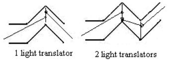

## 문제

A tunnel with square profile consists of (**n**-**1**) sections. Floor in each section is flat and can go up or down along the section. Coordinates [**x1**, **y1**], [**x2**, **y2**], ..., [**xn**, **yn**] where **x1**< **x2**< ... < **xn**describe points where tunnel’s floor starts, ends, or one section joins other. Ceiling of the tunnel is **1** meter above the floor and corresponding sections’ join points are at coordinates [**xi**, **yi**+ **1**].

Laser beam is directed to the tunnel from its start. To facilitate beam transition through the tunnel light translators could be installed at section boundaries. These translators can retransmit laser emission in necessary direction, moreover retransmitted beam not necessarily starts at the point where coming beam hit the translator.

As soon as light translators could be installed at sections boundaries only, their coordinates can only be **x1**, **x2**, ..., **xn**. Your task is to determine the minimal number of light translators necessary to allow bean transition through the tunnel.

## 입력

The first line at input contains integer **N** (**2** ≤ **N** ≤ **1000**). Following **N** lines contain **2** floats each – coordinates **xi**and **yi**(**-10000** ≤ **xi**,**yi**≤ **10000**).

## 출력

The only line at output should contain one integer – the minimal number of light translators necessary.
