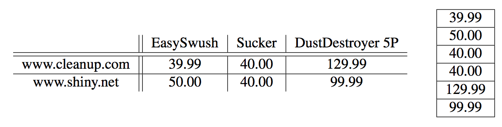

## 문제

The Internet becomes more and more important for our daily life. Aside from information retrieval, many people use the web for comfortable shopping from their home PCs. As the number of online customers grows, so does the number of websites dedicated to comparing online prices. Competitive sites need to quickly visualize the cheapest offers for a certain product. Barter & Haggle Inc. has recently been successful in the field of comparing online prices. However, as more and more comparable services appear, B&H has trouble conserving their market share. This is why the company has decided to improve its technology by comparing prices for different online shops and products simultaneously. The engineers have not been capable of implementing the visualization algorithm, though. This is where you come into play.

Given a table of prices for different products at different online stores, you need to find an optimal reordering of the rows and columns. In order to compare different reorderings, we define the table string to be the string of cells that is obtained from a table by appending all columns. An optimal reordering has the smallest table string with respect to lexicographical comparison (the table string is compared cell-wise).

Table 1: Optimal table of prices for vacuum cleaners and table string.

## 입력

The inputs start with a line containing a single integer n. Each of the n following lines contains one test case. Each test case starts with two integers 1 ≤ a, b ≤ 5, the number of products and online shops respectively. The table string consisting of the prices separated by single spaces follows. Each price p is given as an integer amount of cents with 0 ≤ p ≤ 109.

## 출력

The output for every test case begins with a line containing “Scenario #i:”, where i is the number of the test case counting from 1. Then, output a single line containing the table string of the optimal reordering of products and shops. Terminate each test case with an empty line.
