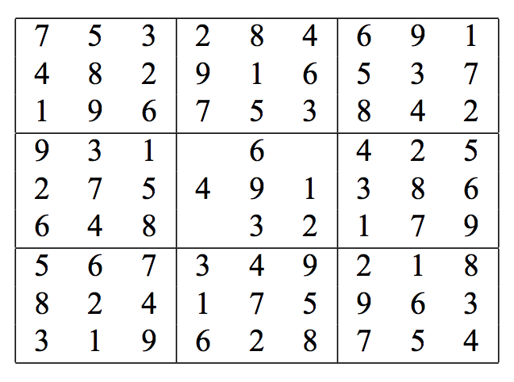

## 문제

Tom is a master in several mathematical-theoretical disciplines. He recently founded a research-lab at our university and teaches newcomers like Jim. In the first lesson he explained the game of Tudoku to Jim. Tudoku is a straight-forward variant of Sudoku, because it consists of a board where almost all the numbers are already in place. Such a board is left over when Tom stops solving an ordinary Sudoku because of being too lazy to fill out the last few straight-forward cells. Now, you should help Jim solve all Tudokus Tom left for him.

Sudoku is played on a 9 × 9 board that is divided into nine different 3 × 3 blocks. Initially, it contains only a few numbers and the goal is to fill the remaining cells so that each row, column, and 3 × 3 block contains every number from 1 to 9. This can be quite hard but remember that Tom already filled most cells. A resulting Tudoku board can be solved using the following rule repeatedly: if some row, column or 3 × 3 block contains exactly eight numbers, fill in the remaining one.

In the following example, three cells are still missing. The upper left one cannot be determined directly because neither in its row, column, or block, there are eight numbers present. The missing number for the right cell can be determined using the above rule, however, because its column contains exactly eight numbers. Similarly, the number for the lower-most free cell can be determined by examining its row. Finally, the last free cell can be filled by either looking at its row, column or block.

## 입력

aThe first line contains the number of scenarios. For each scenario the input contains nine lines of nine digits each. Zeros indicate the cells that have not been filled by Tom and need to be filled by you. Each scenario is terminated by an empty line.

## 출력

The output for every scenario begins with a line containing “Scenario #i:”, where i is the number of the scenario starting at 1. Then, print the solved Tudoku board in the same format that was used for the input, except that zeroes are replaced with the correct digits. Terminate the output for the scenario with a blank line.
