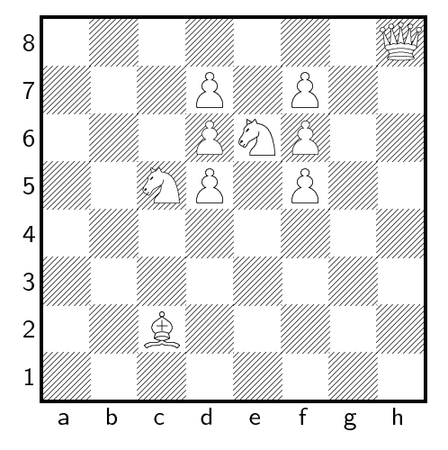

## 문제

Black has been defeated and the white army has won, but unfortunately the white king has been killed in the fight, and so the white queen is looking for a new mate. She is unsure whom of the knights to marry and has decided to visit them all. Afterwards she plans to see the bishop to arrange for the marriage.

Given a chessboard with the current situation, find the shortest number of moves such that the queen visits every knight and, finally, visits the bishop.

The queen visits by standing on one of the (at most) eight neighbouring squares and she does not necessarily have to move between two visits. For each move the queen can go an arbitrary number of squares in one of the eight directions (horizontal, vertical or diagonal). No move may pass through or stop at a non-empty square.

## 입력

The first line contains the number of scenarios. Each scenario consists of a chessboard description. The rows 8, . . . , 1 are given in this order, one line per row. Each line contains 8 characters to represent the squares at columns a, . . . , h of this row. Each description is followed by an empty line.

There is one character Q to denote the starting position of the queen, and one B to denote the square on which the bishop stands. There is an arbitrary number of pawns, given as P, who simply block movement, as well as 2–14 knights denoted as N. All other squares are given as ‘.’ and are empty.

## 출력

The output for every scenario begins with a line containing “Scenario #i:”, where i is the number of the scenario starting at 1.

Then print the lexicographical first path that contains the minimal number of moves, ends adjacent to the bishop and visits each knight at least once. The path shall be given on a single line by concatenating in order the names of the squares on which the queen stands. Each square name consists of a small letter followed by a decimal digit. If no such path exists, output “impossible” on a single line. Terminate the output for the scenario with a blank line.
