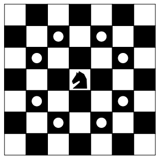

## 문제

The knight is getting bored of seeing the same black and white squares again and again and has decided to make a journey around the world. Whenever a knight moves, it is two squares in one direction and one square perpendicular to this.

The world of a knight is the chessboard he is living on. Our knight lives on a chessboard that has a smaller area than a regular 8 × 8 board, but it is still rectangular. Can you help this adventurous knight to make travel plans?

The eight possible moves of a knight

Find a path such that the knight visits every square once. The knight can start and end on any square of the board.

## 입력

The input begins with a positive integer n in the first line. The following lines contain n test cases.

Each test case consists of a single line with two positive integers p and q, such that 1 ≤ p · q ≤ 26. This represents a p × q chessboard, where p describes how many different square numbers 1, . . . , p exist, q describes how many different square letters exist. These are the first q letters of the Latin alphabet: A, . . .

## 출력

The output for every scenario begins with a line containing "Scenario #i:", where i is the number of the scenario starting at 1. Then print a single line containing the lexicographically first path that visits all squares of the chessboard with knight moves followed by an empty line. The path should be given on a single line by concatenating the names of the visited squares. Each square name consists of a capital letter followed by a number.

If no such path exist, you should output impossible on a single line.
