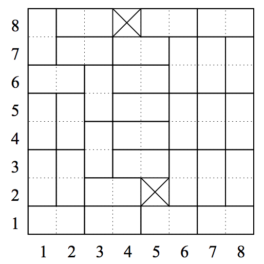

## 문제

Tom gets a riddle from his teacher showing 42 chess boards from each of which two squares are removed.

The teacher wants to know which boards can be completely covered by 31 dominoes. He promises ten bars of chocolate for the person who solves the problem correctly. Tom likes chocolate, but he cannot solve this problem on his own. So he asks his older brother John for help. John (who likes chocolate as well) agrees, provided that he will get half the prize.

John’s abilities lie more in programming than in thinking and so decides to write a program. Can you help John? Unfortunately you will not win any bars of chocolate, but it might help you win this programming contest.

You are given are 31 dominoes and a chess board of size 8 × 8, two distinct squares of which are removed from the board. The square in row a and column b is denoted by (a, b) with a, b ∈ {1, . . . , 8}.

A domino of size 2 × 1 can be placed horizontally or vertically onto the chess board, so it can cover either the two squares {(a, b), (a, b + 1)} or {(b, a), (b + 1, a)} with a ∈ {1, . . . , 8} and b ∈ {1, . . . , 7}. The object is to determine if the so-modified chess board can be completely covered by 31 dominoes.

For example, it is possible to cover the board with 31 dominoes if the squares (8, 4) and (2, 5) are removed, as you can see in Figure 1.

Figure 1: A possible covering where (8, 4) and (2, 5) are removed.

## 입력

The first input line contains the number of scenarios k. Each of the following k lines contains four integers a, b, c, and d, separated by single blanks. These integers in the range {1, . . . , 8} represent the chess board from which the squares (a, b) and (c, d) are removed. You may assume that (a, b) ≠ (c, d).

## 출력

The output for every scenario begins with a line containing “Scenario #i:”, where i is the number of the scenario starting at 1. Then print the number 1 if the board in this scenario can be completely covered by 31 dominoes, otherwise write a 0. Terminate the output of each scenario with a blank line.
