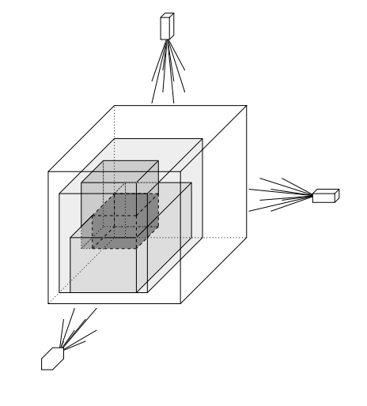

## 문제

The world famous artist A.A. Blox, well known for his cubic sculptures, has developed a totally new way to create impressive artwork from a rectangular solid of transparent acrylic glass. With the patented laser device of his friend T.D. Resal, he is able to change the colour of parts of the originally colourless box. Due to the prototype stadium of the laser device, he can only change the colour of a rectangular solid whose sides are parallel to the sides of the large box (“axis aligned”).

The value of the resulting object is measured by the volume of coloured acrylic glass. Since A.A. Blox is not good at mathematics, he has hired you to help him out and compute the price of his artwork for him.

For a given three-dimensional axis aligned initial box b and a set S of three-dimensional axis aligned boxes, you have to compute the volume of the union of all parts of the boxes of S that lie within b. Make sure that you count the volume of overlapping parts of the boxes only once!

## 입력

The first line contains the number of scenarios.

For each scenario you are given a line containing x1 y1 z1 x2 y2 z2, defining the two corners (x1, y1, z1), (x2, y2, z2) of the initial axis aligned box b. All numbers are separated by single blanks.

The following line contains the number m (m ≤ 2000) of boxes in S whose colour was changed by the laser device, followed by m lines each containing x1 y1 z1 x2 y2 z2, defining the two corners (x1, y1, z1), (x2, y2, z2) of one of the axis aligned boxes in S. All numbers are separated by single blanks.

All coordinates are in the range from 0 to 1000, and the coordinates in each line satisfy x1 ≤ x2, y1 ≤ y2 and z1 ≤ z2.

## 출력

Start the output for every scenario with a line containing “Scenario #i:”, where i is the number of the scenario starting at 1. Then print a line containing the total volume of coloured acrylic glass. Terminate the output for the scenario with a blank line.
