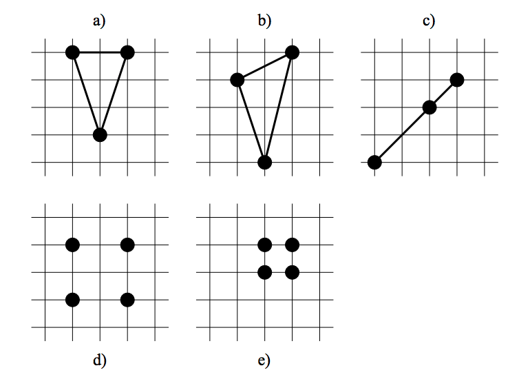

## 문제

Hello Earthling. We’re from the planet Regetni and need your help to make lots of money. Maybe we’ll even give you some of it.

You see, the problem is that in our world, everything is about integers. It’s even enforced by law. No other numbers are allowed for anything. That said, it shouldn’t surprise you that we use integer coordinate systems to plan our cities. So far only axis-aligned rectangular plots of land have been sold, but our professor Elgnairt recently had the revolutionary idea to sell triangular plots, too. We believe that the high society will love this concept and it’ll make us rich.

Unfortunately the professor patented his idea and thus we can’t just do it. We need his permission and since he’s a true scientist, he won’t give it to us before we solve some damn riddle. Here’s where you come in, because we heard that you’re a genius.

The professor’s riddle goes like this: Given some possible corners for the triangles, determine how many triangles with integral size can be built with them. Degenerated triangles with empty area (i.e. lines) have to be counted, too, since 0 is an integer. To be more precise, count the number of triangles which have as corners three different points from the input set of points. All points in a scenario will be distinct, i.e. there won’t be duplicates. Here are some examples:

Example a) shows a triangle with integral area (namely 3), b) shows one with non-integral size, c) shows a degenerated triangle with empty area (i.e. zero, so count it!), d) shows four points of which you can choose any three to build an integral area triangle and e) shows four points where you can’t build any integral area triangles at all.

Hint: The area A of a triangle with corners (x1, y1), (x2, y2) and (x3, y3) can be computed like this:

A = |x1y2 − y1x2 + x2y3 − y2x3 + x3y1 − y3x1| / 2

Try to make clever use of this formula.

## 입력

The first line contains the number of scenarios. For each scenario, there is one line containing first the number N of distinct points in that scenario (0 ≤ N ≤ 10000) and after that N pairs of integers, each pair describing one point (xi, yi) with −100000 ≤ xi, yi ≤ 100000. All these numbers are separated by single blanks.

## 출력

Start the output for every scenario with a line containing “Scenario #i:”, where i is the number of the scenario starting at 1. Then print a single line containing the number of triangles with integral area whose three distinct corners are among the points given. Terminate the output for each scenario with a blank line.
