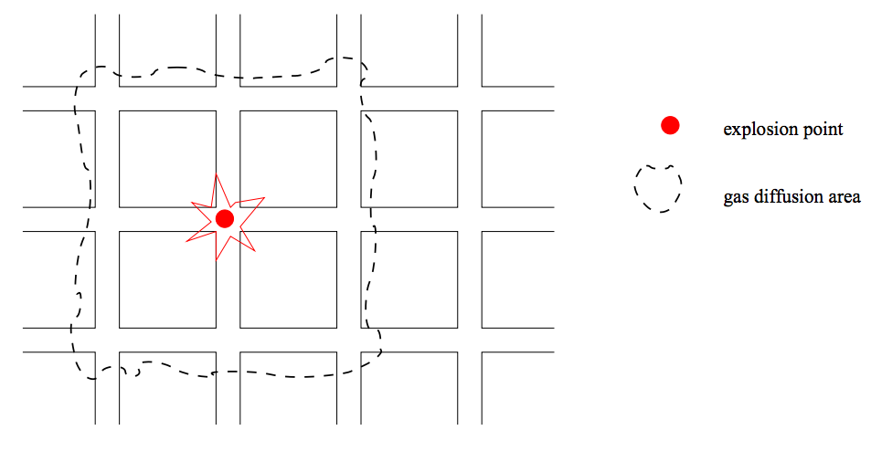

## 문제

Baaaam! Another deadly gas bomb explodes in Manhattan’s underworld. Rats have taken over the sewerage and the city council is doing everything to get the rat population under control.

As you know, Manhattan is organized in a regular fashion with streets and avenues arranged like a rectangular grid. Waste water drains run beneath the streets in the same arrangement and the rats have always set up their nests below street intersections. The only viable method to extinguish them is to use gas bombs like the one which has just exploded. However, gas bombs are not only dangerous for rats. The skyscrapers above the explosion point have to be evacuated in advance and so the point of rat attack must be chosen very carefully.

The gas bombs used are built by a company called American Catastrophe Management (ACM) and they are sold under the heading of “smart rat gas”. They are smart because — when fired — the gas spreads in a rectangular fashion through the understreet canals. The strength of a gas bomb is given by a number d which specifies the rectangular “radius” of the gas diffusion area. For example, Figure 2 shows what happens when a bomb with d = 1 explodes.

Figure 2: Diffusion area of gas after an explosion.

The area of interest consists of a discrete grid of 1025 × 1025 fields. Rat exterminator scouts have given a detailed report on where rat populations of different sizes have built their nests. You are given a gas bomb with strength d and your task is to find an explosion location for this gas bomb which extinguishes the largest number of rats.

The best position is determined by the following criteria:

* The sum of all rat population sizes within the diffusion area of the gas bomb (given by d) is maximal.
* If there is more than one of these best positions then the location with the “minimal” position will be chosen. Positions are ordered first by their x coordinate and second by their y coordinate.

Formally, given a location (x1, y1) on the grid, a point (x2, y2) is within the diffusion area of a gas bomb with strength d if the following equation holds:

max(abs(x2 − x1), abs(y2 − y1)) ≤ d

## 입력

The first line contains the number of scenarios in the input.

For each scenario the first line contains the strength d of the gas bomb in the scenario (1 ≤ d ≤ 50). The second line contains the number n (1 ≤ n ≤ 20000) of rat populations. Then for every rat population follows a line containing three integers separated by spaces for the position (x, y) and “size” i of the population (1 ≤ i ≤ 255). It is guaranteed that position coordinates are valid (i.e., in the range between 0 and 1024) and no position is given more than once.

## 출력

For every problem print a line containing the x and y coordinate of the choosen location for the gas bomb, followed by the sum of the rat population sizes which will be extinguished. The three numbers must be separated by a space.
