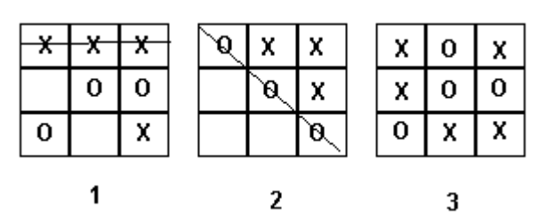
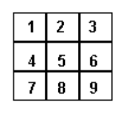

## 문제

Noughts and crosses is a simple game played by 2 people. The aim is to get a row of 3 of your own symbols (vertically, horizontally or diagonally) before your opponent can do so. For example:



Game 1 shows X winning with a horizontal row. Game 2 shows O winning with a diagonal row. Game 3 is a draw as neither side has completed a row.

## 입력

In this problem you will be given one or more games to follow and must determine who has won. Each game occupies a single line and begins with a letter, X or O, which shows who takes the first turn. Input is terminated by a line which contains just the character # - this line should not be processed.

A number of turns follow the initial letter, on the same line, all separated from each other by a space. A turn is designated by one of the numbers from 1 to 9, numbers representing board squares as shown below:



Game 1 above could have been represented as

```

X 1 5 9 7 3 6 2
```

## 출력

For each game in the input, 1 line of output should be given. If there is a winner, the output should be an upper case X or an upper case O as appropriate. If there is no winner, the output should be the word Draw.
