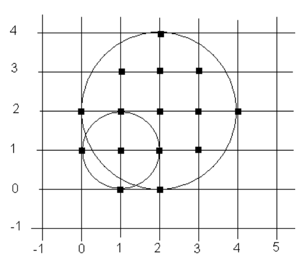

## 문제

Your task is to write a program that outputs the number of points with integer coordinates that are contained in the union of a given set of circles (where the radii and centre points of the circles are also integers).

For example, the smaller circle (centre (1,1), radius 1) in the diagram below contains 5 points; the larger circle (centre (2,2), radius 2) contains 13 points; and the union of the two circles contains 15 points. Points exactly on the boundary of a circle are considered to be contained by the circle.

As an additional constraint, your program must only count points with x and y coordinates that are integers in the range [-(2^14-1),2^14]. Circles may extend past the boundaries of this region, but points outside this region must not be counted.

## 입력

The input includes a number of area problems. Each problem has n lines, where n is the number of circles – one line per circle. Each line has three integer values, separated by spaces: the x coordinate of the circle's centre, the y coordinate, and the radius. The end of input for a problem is indicated by a line with three zeroes. There will be no more than 10,000 circles in one problem. A set with no circles marks the end of the problem set.

## 출력

For each problem output a line with ‘Problem #n:’, followed by a space and the number of contained points.
