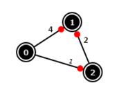

## 문제

방향 가중치 그래프 G와 G의 두 정점 s와 t가 주어졌을 때, p(s, t)를 s에서 t까지 최단 거리의 가중치의 합이라고 하자. 만약, s에서 t에 도달할 수 없다면, p(s, t)는 1,000,000,000로 정의한다.

이 문제의 입력은 그래프 G와 쿼리 Q개 (s1, t1), (s2, t2), ..., (sQ, tQ)이다.

출력은 각 쿼리의 결과 p(s1, t1), p(s2, t2), ..., p(sQ, tQ)이다.

## 입력

입력은 총 두 개의 블록으로 이루어져 있다. 첫 번째 블록은 그래프 G의 인접 리스트를 나타내고, 두 번째 블록은 쿼리를 나타낸다.

첫 번째 블록의 첫째 줄에는 G의 정점의 개수 V가 주어진다. 정점은 0번부터 V-1번까지 번호로 매겨져 있다. 다음 V개 줄에는 0번 정점부터 해당하는 정점의 정보가 주어진다. 첫 번째 수는 ni이며, 이는 정점 i에서 나가는 간선의 개수를 나타낸다. 그 다음에는 총 ni개의 (j, w)쌍이 주어지며, 각 쌍은 해당하는 간선을 나타낸다. 첫 번째 정수 j는 간선이 가리키는 정점의 번호, w는 그 간선의 가중치이다.

두 번째 블록의 첫째 줄에는 Q가 주어진다. 다음 Q개 줄에는 sk와 tk가 주어진다.

연속하는 모든 두 정수는 공백으로 구분되어져 있어야 한다. 또, 입력은 다음과 같은 조건을 만족해야 한다.

1. 0 < V ≤ 300
2. ni는 음이 아닌 정수
3. 0 ≤ j < V
4. |w| < 106
5. 0 ≤ Σni ≤ 5000 (i = 0 ~ V-1)
6. 0 < Q ≤ 10
7. 0 ≤ sk < V, 0 ≤ tk < V
8. 그래프 G는 가중치의 합이 음수인 사이클을 가지고 있으면 안 된다.

## 출력

출력은 Q개의 줄로 이루어져 있으며, k번째 줄에는 p(sk, tk)를 출력한다. 편의를 위해 마지막 줄에는 counter변수의 값을 출력한다.

## 힌트

