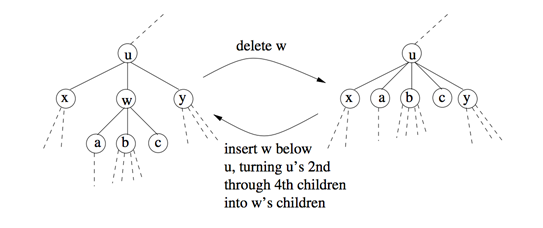

## 문제

숫자가 적혀져 있고, 순서가 있는 루트 있는 트리(Labeled and ordered rooted tree) 2개 T와 T'가 주어진다. 이때, T와 T'사이의 거리를 구하는 프로그램을 작성하시오. 거리란 T를 T'와 동등하게 만드는 최소 연산의 횟수이다.

연산은 총 세가지로 이루어져 있다.

1. T의 한 노드에 적혀있는 숫자를 바꾼다.
2. T에서 루트가 아닌 노드를 하나 삭제한다.
3. T의 루트 아래 어딘가에 노드를 하나 삽입한다.

T와 T'는 순서가 있는 트리이다. 따라서, 리프가 아닌 노드가 자식을 c개 가지고 있는 경우에 1부터 c까지 순서가 존재하며, 1번째 자식, 2번째 자식, ..., c번째 자식이 존재한다.

X와 Y가 동등한 트리가 되려면 X와 Y의 루트에 같은 숫자가 적혀있어야 하고, 같은 개수의 자식을 가져야 한다. 자식의 수를 c라고 했을 때, i번째 자식을 루트로하는 서브트리가 동등해야 한다. (i = 1, 2, ..., c)

T의 루트가 아닌 노드를 삽입하고 삭제하는 방법은 다음과 같다. 먼저, 루트가 아닌 노드 w가 자식을 d개 가지고 있고, w의 부모가 u이고, w가 u의 i번째 자식인 경우를 생각해보자. w를 삭제하게 되면, w의 첫 번째 자식은 u의 i번째 자식이 되고, 두 번째 자식은 u의 (i+1)번째 자식이 된다. j<i인 u의 j번째 자식의 순서는 그대로 유지되지만, j>i인 j번째 자식은 모두 u의 (j+d-1)번째 자식이 된다. w의 자식이 u의 자식으로 삽입되어서 오른쪽으로 밀려난다고 생각하면 된다.

루트가 아닌 노드 w를 삽입하려면, 먼저 w의 부모가 될 노드 u를 선택해야 한다. 그 다음, u의 자식 중에서 연속된 부분 수열을 골라서 w의 자식으로 만들어주고, 그 자리에 w를 삽입한다. 삽입과 동시에 w에는 적절한 숫자를 적을 수 있다.

T의 루트를 삭제하거나, 루트의 위에 새 노드를 삽입하는 것은 불가능하다. 루트에 적혀있는 숫자는 바꿀 수 있다.

w를 삭제하는 경우와 u의 2번째 자식부터 4번째 자식을 w의 자식으로 만들고 u 아래에 삽입하는 경우.

## 입력

첫째 줄에 T와 T'의 크기 n, m이 주어진다. (1 ≤ n, m ≤ 60) 다음 n개 줄에는 T의 정보가 주어진다. i번째 줄에는 i번째 노드의 정보가 주어진다. 노드에 적혀있는 숫자, 자식의 수가 주어지며, 그 다음에는 자식이 순서대로 주어진다. 다음 m개 줄에는 T'의 정보가 주어진다. 숫자는 항상 음이 아닌 정수이며, 각 트리의 루트 노드는 다른 노드의 자식으로 포함되지 않는 노드이다.

## 출력

T를 T'와 동등하게 만들기 위해 필요한 연산의 최소 횟수를 출력한다.
