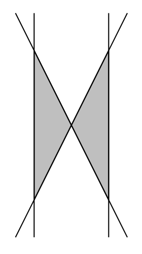

## 문제

Do you know how easy it is to make a very simple problem into a brutally hard one? Here is an example. How many triangles can you make with N straight lines in the plane? As long as they have different slopes and no three of them meet at a single point, there will be \(N \choose 3\)  triangles, which is the maximum possible you can get.

Okay, that wasn’t too bad. But let’s see what happens if we only count triangles that are empty (that is, none of the lines pass through the interior of the triangle). Then, the number of triangles suddenly becomes very small. For example, with 4 straight lines, we can only make 2 empty triangles, whereas the total number of triangles can be as big as 4. Refer to the diagram.

In fact, a general formula for the maximum number of empty triangles that can be drawn with N lines is not known. The hard part, however, is to find the right configuration of the lines. Your job is much easier; given N straight lines on the plane, count the number of empty triangles.

Figure 1: Four lines making two empty triangles (shaded).

## 입력

The input consists of multiple test cases. Each test case begins with a line containing an integer N, 1 ≤ N ≤ 500, which indicates the number of lines on the plane. The next N lines each contain four integers x1, y1, x2, and y2 (between −1,000 and 1,000), representing a straight line that goes through (x1, y1) and (x2, y2). It is guaranteed that no three lines meet at the same point, and all the lines are distinct. The input terminates with a line with N = 0.

## 출력

For each test case, print out a single line that contains the number of empty triangles formed by the given lines.
