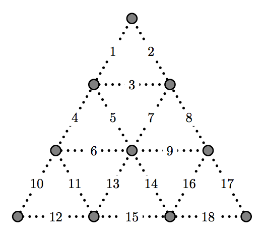
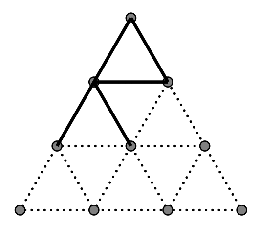

## 문제

Andy and Ralph are playing a two-player game on a triangular board that looks like the following:

At each turn, a player must choose two adjacent vertices and draw a line segment that connects them. If the newly drawn edge results in a triangle on the board (only the smallest ones count), then the player claims the triangle and draws another edge. Otherwise, the turn ends and the other player plays. The objective of the game is to claim as many triangles as possible. For example, assume that it is Andy’s turn, where the board has fives edges as shown in the picture below. If Andy draws edge 6, then he will claim the triangle formed by edge 4, 5, and 6, and continue playing.

Given a board that already has some edges drawn on it, decide the winner of the game assuming that both Andy and Ralph play optimally. Andy always goes first. Note that if a triangle exists on the board before the first move, neither player claims it.

## 입력

The input consists of multiple test cases. Each test case begins with a line containing an integer N, 5 ≤ N ≤ 10, which indicates the number of edges that are already present on the board before the game begins. The next line contains N integers, indicating the indices of these edges. The input terminates with a line with N = 0.

## 출력

For each test case, print out a single line that contains the result of the game. If Andy wins, then print out “Andy wins”. If Ralph wins, then print out “Ralph wins”. If both players get the same number of triangles, then print out “Draw”. Quotation marks are used for clarity and should not be printed.
