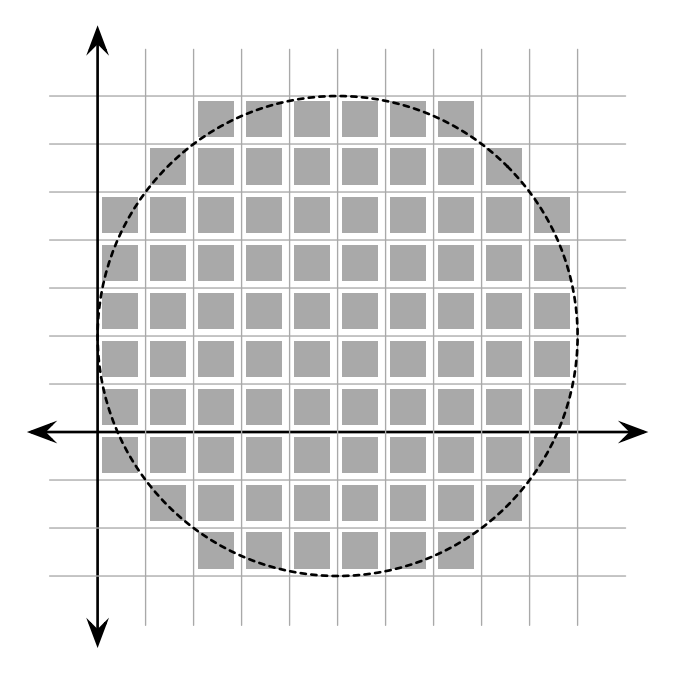

## 문제

Did you know that if you draw a circle that fills the screen on your 1080p high definition display, almost a million pixels are lit? That’s a lot of pixels! But do you know exactly how many pixels are lit? Let’s find out!

Assume that our display is set on a Cartesian grid where every pixel is a perfect unit square. For example, one pixel occupies the area of a square with corners (0, 0) and (1, 1). A circle can be drawn by specifying its center in grid coordinates and its radius. On our display, a pixel is lit if any part of is covered by the circle being drawn; pixels whose edge or corner are just touched by the circle, however, are not lit.

Your job is to compute the exact number of pixels that are lit when a circle with a given position and radius is drawn.

## 입력

The input consists of several test cases, each on a separate line. Each test case consists of three integers, x, y, and r (1 ≤ x, y, r ≤ 106), specifying respectively the center (x, y) and radius of the circle drawn. Input is followed by a single line with x = y = r = 0, which should not be processed.

## 출력

For each test case, output on a single line the number of pixels that are lit when the specified circle is drawn. Assume that the entire circle will fit within the area of the display.
