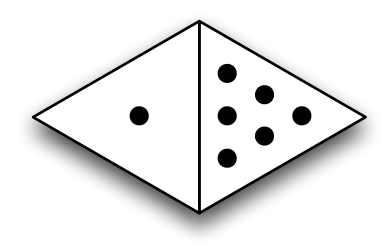
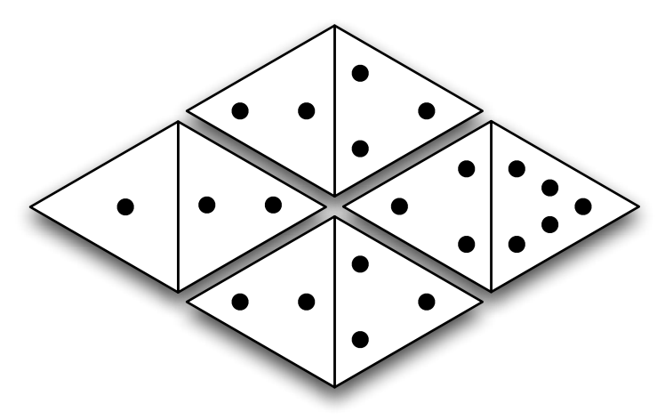

## 문제

We’ve all seen regular dominoes before—they look like rectangular tiles, twice as long as they are wide, with pips designating a number between 1 and 6 on each of their two ends. The object of a dominoes game involves some variation of tiling the dominoes so that the numbers on adjacent dominoes match up.

Now what if we were to make the dominoes out of equilateral triangles, like this:

An equilateral domino is shaped like a quadrilateral made up of two equilateral triangles. Again, the triangle at each end depicts a number from 1 to 6. Two equilateral dominoes can be tiled next to each other if the domino ends on either side of their shared edge have the same value, and if neither domino overlaps another. Once you have begun a tiling, additional dominoes may only placed adjacent to one or more of the dominoes already on the table. In other words, two more disjoint groups of dominoes does not constitute a valid tiling. For example, equilateral dominoes may be tiled like this:

Your task is to find a best tiling, in some sense, of some equilateral dominoes. If you score one point for every edge that is shared between two dominoes, what is the best way to tile a given set of equilateral dominoes to achieve the highest score?

## 입력

The input consists of multiple test cases. The first line of each test case contains an integer N, 1 ≤ N ≤ 6, the number of equilateral dominoes in that set. This is followed by N lines with two integers each (values between 1 and 6 inclusive), with each line indicating the pip values on each of the dominoes in the set. Input is followed by a single line with N = 0, which should not be processed.

## 출력

For each test case, output a single line containing the highest tiling score that can be achieved with the given set of equilateral dominoes. If there is no valid tiling of the dominoes, output a zero.
