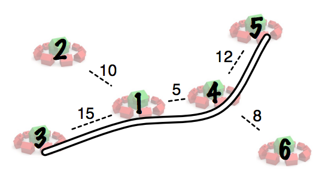

## 문제

As head of the Accessible Commuting Movement (ACM), you’ve been lobbying the mayor to build a new highway in your city. Today is your lucky day, because your request was approved. There is one condition though: You must provide the plan for the best highway artery to construct, or else it’s not going to happen!

You have a map that shows all communities in your city, each with a unique number, where you may place highway on-ramps. On the map are a set of roadways between pairs of communities, labelled with driving distances, which you may choose to replace with your highway line. Using this network of roadways, there is exactly one route from any one community to another. In other words, there are no two different sets of roadways that would lead you from community A to community B.

You can build a single highway that runs back and forth between any two communities of your choosing. It will replace the unique set of roadways between those two communities, and an on-ramp will be built at every community along the way. Of course, residents of communities that will not have an on-ramp will have to drive to the nearest one that does in order to access your new highway.

You know that long commutes are very undesirable, so you are going to build the highway so that longest drive from any community to the nearest on-ramp is minimized. Given a map of your city with the roadways and driving distances, what is the farthest distance from any community that someone would have to drive to get to the nearest on-ramp once your new highway is complete?

## 입력

The input consists of multiple test cases. Each test case is a description of a city map, and begins with a single line containing an integer N (2 ≤ N ≤ 100,000), the number of communities in the city. Then N − 1 lines follow, each containing three integers, i, j (1 ≤ i, j ≤ n), and d (1 ≤ d ≤ 10,000). Each line indicates that communities i and j are connected by a roadway with driving distance d. Input is followed by a single line with N = 0, which should not be processed.

## 출력

For each city map, output on a single line the farthest distance from any community to the nearest on-ramp of the new highway.
