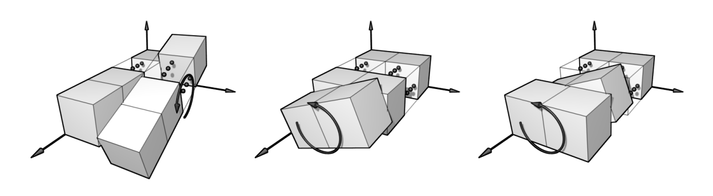
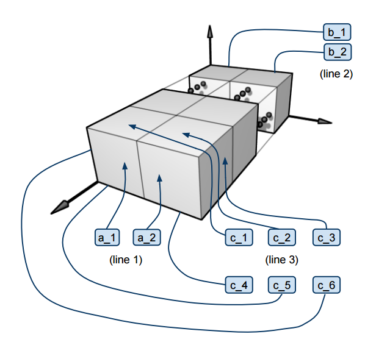

## 문제

Montgomery Burns has recently acquired a rod with dimensions 1 × 2 × N, where 3 ≤ N ≤ 100,000. The mechanics of Burns’ Rod resemble those of a standard 3 × 3 × 3 Rubik’s Cube; in fact, one can twist it around in N + 1 different ways as follows (all twists must be by multiples of 180 degrees):

The long length of the rod has made it particularly useful for a variety of essential day-to-day errands: it has successfully served Burns as a back-scratcher, TV remote replacement and as a means to prod one Waylon Smithers. However, during its most recent stint as a fishing rod, it fell into a pond when Burns was unable to sustain the weight of a particularly hungry goldfish. Unfortunately, this meant the coloured labels peeled off, leaving an unlabelled Rod, 6N +4 sticky labels and a very confused goldfish splashing around in the pond.

Smithers, as dutiful as ever, retrieved the sticky labels and pasted them back on the Rod. Due to Smithers’ haste to reaffix the labels before the adhesive completely wore off, however, the labels were randomly placed back on! Burns, as exceedingly reasonable as he is, has become wary of Smithers’ performance, and is concerned that the Rod may no longer be solvable.

You are Lisa Simpson, and Burns has come desperately seeking your help. Can you determine if the Rod is solvable? Note that the Rod is said to be solvable if there is a sequence of twists, as described above, such that any two labels are the same color if and only if they’re on the same face of the Rod. Moreover, cheap manufacturing processes mean that the labels could have changed color while floating around in the pond.

## 입력

The input consists of several test cases. The first line of each test case contains a single integer N, 3 ≤ N ≤ 100,000, denoting the length of the Rod. Following this are N +2 lines, describing the affixed colors—assume the Rod lies flat, pointing away from you:

* The first line has two space-separated integers, a1 (your left) and a2 (your right), denoting the colors of the two labels closest to you and facing you.
* The second line has two space-separated integers, b1 (your left) and b2 (your right), denoting the colors of the two labels furthest from you and facing away.
* The (2 + k)-th line has six space-separated integers, c1, c2, c3, c4, c5 and c6, denoting the colors affixed to the two blocks at position k from you—the colors are ordered clockwise, proceeding in this order: top left, top right, right, bottom right, bottom left, left.

Each color is a number between 0 and 5, inclusive. Input is followed by a single line with N = 0, which should not be processed.

## 출력

For each test case, print out a single line that contains the word “solvable” (no quotes) if the rod is solvable, or “unsolvable” otherwise.

## 힌트

