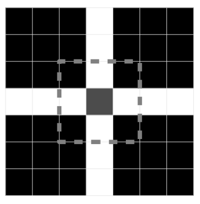

## 문제

You have been given a square grid with a number of non-overlapping energy cells on it. These energy cells are quite peculiar; they are all squares, and despite their differences in sizes, they all produce the exact same amount of energy. From this grid, you wish to collect as much energy as possible, using a special collector. This collector is also square, and must be placed onto the grid on top of the energy cells. The collector can be resized to whatever size you want, as long as it remains grid-aligned (i.e., the size must be integral). The collector will collect all of the energy from any energy cell it overlaps (that is, the intersection of the collector with the energy cell has positive area), but only if the energy cell is at least as large as the collector. Energy cells that are smaller than the collector cannot be collected at all, regardless of location. Find a location and size for the collector so as to maximize the amount of energy collected.

## 입력

The input consists of several test cases. The first line of each test case consists of a single integer N (1 ≤ N ≤ 1,000) denoting the number of energy cells. This is followed by N lines with 4 space-separated integers each describing the energy cell, x1, y1, x2, and y2, where (x1, y1) is the lower left corner of the cell and (x2, y2) is the upper right corner of the cell (−106 ≤ x1 < x2 ≤ 106 , −106 ≤ y1 < y2 ≤ 106 , x2 − x1 = y2 − y1). Input is followed by a single line with N = 0, which should not be processed.

## 출력

For each test case, print out a single line with 4 space-separated integers describing the location of the collector, x1, y1, x2, and y2, where (x1, y1) is the lower left corner of the collector and (x2, y2) is the upper right corner of the collector. Any collector that collects the maximum possible amount of energy will be judged correct.
